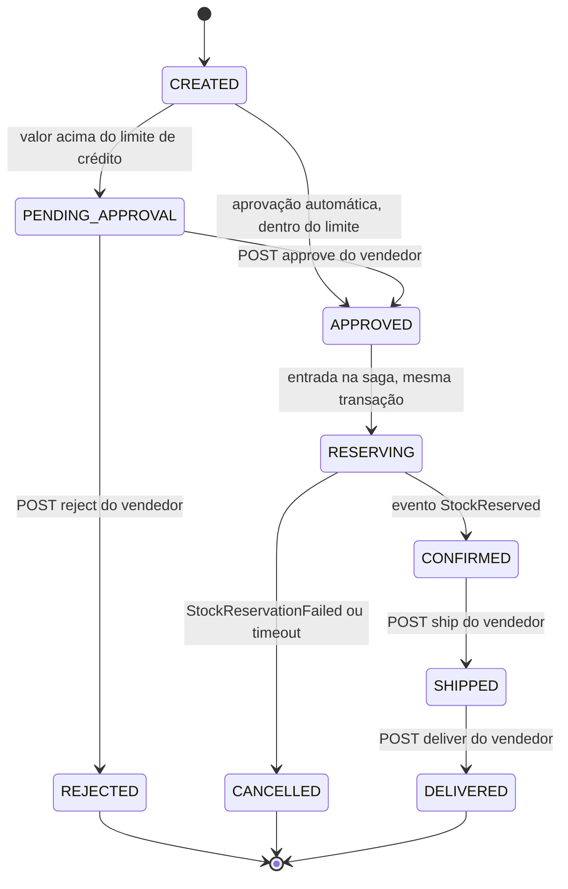

# Phase 6: Ciclo de Vida Completo — Expedição, Entrega e Histórico do Pedido - Research

**Researched:** 2026-09-30
**Domain:** Extensão de uma saga orquestrada por eventos já existente (Spring Boot 3.5 / Spring Cloud AWS 3.4 / JPA + Flyway / Transactional Outbox / SQS + DynamoDB via LocalStack). Nenhuma tecnologia nova: a fase reusa os padrões provados nas Fases 3-5.
**Confidence:** HIGH (todo o código-base foi lido nesta sessão; os únicos pontos externos são o algoritmo S10 e a sintaxe Mermaid, ambos confirmados por busca)

<user_constraints>
## User Constraints (from CONTEXT.md)

### Locked Decisions

**Transportadora simulada (ORD-07)**
- **D-70:** Transportadora e código de rastreio são atribuídos **no CONFIRMED, na mesma transação** em que o resultado `StockReserved` leva o pedido de RESERVING a CONFIRMED (`OrderSagaService`). Nunca existe pedido CONFIRMED sem transportadora. Sem I/O de rede, porque o mock é interno (D-41 continua respeitada).
- **D-71:** Mock como **costura de integração explícita**: interface `CarrierGateway` com implementação `SimulatedCarrierGateway` (nomes exatos a critério do planejamento). Lista fixa de transportadoras fictícias brasileiras; a escolha é **determinística por pedido** (ex.: derivada do `orderId`), para que testes e reprocessamentos sejam reproduzíveis.
- **D-72:** O mock **nunca falha**. Sem Resilience4j e sem falha simulada nesta fase: não existe chamada externa dentro da transação que justifique circuit breaker.
- **D-73:** Código de rastreio no **padrão Correios / UPU S10**: 2 letras + 9 dígitos + `BR` (ex.: `AB123456789BR`), único por pedido. Colunas novas no pedido (ex.: `carrier`, `tracking_code`) expostas no `OrderResponse`. — **Reversibility:** costly — os campos entram no contrato da API (`ORDER_RESPONSE_CONTRACT`), no smoke e no payload do evento ORDER_CONFIRMED da timeline.

**Expedição, entrega e baixa de estoque**
- **D-74:** Dois endpoints de ação, **só SELLER_ADMIN**, sem corpo, devolvendo 200 com o pedido: `POST /orders/{id}/ship` (CONFIRMED → SHIPPED) e `POST /orders/{id}/deliver` (SHIPPED → DELIVERED). Seguem o padrão de `/approve`/`/reject` (Fase 4, `OrderDecisionController`). Transição inválida → **409** com mensagem clara, no mesmo formato de erro `{"error","message","fields"}` (generalizar ou irmanar `OrderNotPendingException`). Pedido inexistente → 404.
- **D-75:** A baixa de `quantity_on_hand` (D-57) é um **comando assíncrono pelo outbox**: `/ship` grava `status = SHIPPED` e um comando (ex.: `ShipStock`, `reservationId = orderId`) no outbox do order-service **na mesma transação**. O inventory-service baixa `quantity_on_hand` e `quantity_reserved` juntos e marca a reserva como expedida no livro `stock_reservations`, com idempotência por `reservation_id` (reentrega não baixa de novo). O pedido **não espera resposta**, porque a reserva já garantiu o estoque. Não há estado intermediário (ex.: SHIPPING). — **Reversibility:** costly — novo comando no contrato order ↔ inventory (`SAGA_MESSAGE_CONTRACT`) e nova semântica no livro de reservas compartilhado pela saga e pela reserva REST.
- **D-76:** Cada transição registra **quando e quem**: colunas `shipped_at`/`shipped_by` e `delivered_at`/`delivered_by` (claim `sub` do JWT), expostas no `OrderResponse` ao lado de `confirmedAt`/`cancelledAt`. Migração Flyway V3 no order-service.
- **D-77:** **CANCELLED continua alcançável só pela saga** (falha de reserva ou timeout, Fase 5). Um pedido CONFIRMED, SHIPPED ou DELIVERED não pode ser cancelado nesta fase: qualquer tentativa de transição para fora do fluxo é 409. SHIPPED e DELIVERED continuam consumindo crédito (D-37).

**Linha do tempo no histórico**
- **D-78:** **Toda transição persistida** do pedido gera um evento de timeline: `ORDER_CREATED`, `ORDER_PENDING_APPROVAL`, `ORDER_APPROVED` (automática ou manual, com `decidedBy`), `ORDER_REJECTED` (com motivo), `ORDER_CONFIRMED` (com transportadora e rastreio), `ORDER_CANCELLED` (com `cancellationCode` e motivo), `ORDER_SHIPPED` e `ORDER_DELIVERED`. A entrada em RESERVING fica coberta pelo `ORDER_APPROVED`, sem evento próprio. Cada evento carrega `orderId`, `companyId`, `eventId`, `eventType`, `occurredAt` e os campos do tipo. — **Reversibility:** costly — os tipos e o formato do evento são contrato entre order-service e notification-service.
- **D-79:** Os eventos saem pelo **outbox do order-service** na mesma transação da mudança de status, e o relay passa a rotear `eventType` `ORDER_*` para a `notification-events-queue` existente (Fase 3, desenhada como fan-out). Nenhum envio direto (Key Decision da Fase 5: relay é o único caminho de envio SQS). Sem fila nova.
- **D-80:** **Mesma tabela `notification-history`, PK renomeada para um nome genérico** (ex.: `entityId`/`aggregateId`) no lugar de `productId`. Eventos de produto (`STOCK_ADJUSTED`) e de pedido convivem, e a sort key `eventType#eventId` (D-33) não muda. O init hook `01-create-notification-resources.sh`, o `NotificationRecord`, o repositório e os testes da Fase 3 são ajustados juntos. O estado do LocalStack é recriado na subida, então não há dado real a migrar. Realiza a intenção de D-32. — **Reversibility:** costly — muda o key-schema da tabela e o bean `@DynamoDbBean`; uma nova troca depois exige recriar a tabela e reescrever o mapeamento.
- **D-81:** Consulta por **endpoint novo `GET /notifications/orders/{orderId}`**, lista em ordem cronológica (mesma ordenação de leitura da Fase 3). Cada registro de pedido guarda o `companyId`: **SELLER_ADMIN vê qualquer pedido; BUYER só vê se o `company_id` do JWT bater, senão recebe 404** (mesmo padrão de D-47, sem revelar a existência). É a "regra nova e explícita" prevista no javadoc do `NotificationController`.
- **D-82:** O `NotificationService` deixa de aceitar só `STOCK_ADJUSTED`: valida e monta a mensagem legível por tipo de evento (ex.: "Pedido confirmado — transportadora X, rastreio AB123456789BR"). Continua com o descarte com log para mensagem inválida, o limite de tamanho do payload e a idempotência por chave (`putItem` sem condição).

**Diagrama e prova do fluxo (ORD-10, critério 4)**
- **D-83:** As transições permitidas vivem em **um único lugar do código** (ex.: `OrderStatus.canTransitionTo` ou uma tabela de transições), usado pelos endpoints de ação e pela saga. Um **teste parametrizado exaustivo** cobre todos os pares (de, para) de `OrderStatus` e compara com a tabela documentada. O diagrama é escrito a partir da mesma lista.
- **D-84:** Diagrama **Mermaid `stateDiagram-v2`** no `README.md` e versão detalhada em `docs/VISAO-GERAL.md`, com cada transição anotada pelo gatilho (endpoint, evento da saga, timeout). O diagrama mostra RESERVING e o APPROVED lógico da D-50 como são de fato.
- **D-85:** Demonstração na stack real com **`scripts/smoke-order-lifecycle.sh`** (estilo dos smokes existentes): cria o pedido, espera CONFIRMED com transportadora e rastreio, chama `ship` e `deliver`, confere a baixa de `on_hand`/`reserved` no inventory e a timeline completa em `/notifications/orders/{id}`, e prova uma transição inválida (409). `smoke-order-saga.sh` e `smoke-order-flow.sh` são ajustados se os novos campos ou a rota do histórico mudarem.
- **D-86:** **E2E estendido** no módulo `e2e-tests`: novo cenário CONFIRMED → `ship` → o inventory baixa `on_hand` e `reserved` (Awaitility). O notification-service **não** entra como terceiro contexto. A timeline é provada por testes de integração próprios (Testcontainers LocalStack), e o smoke cobre a junção dos três serviços.

### Claude's Discretion
- Nomes exatos: `CarrierGateway`/`SimulatedCarrierGateway`, lista de transportadoras, algoritmo determinístico, nome do comando de baixa (`ShipStock` ou outro), nome da PK genérica, nomes das colunas novas.
- Se o `ShipStock` para uma reserva inexistente, liberada ou já expedida é no-op idempotente com log ou anomalia técnica (lançar exceção → DLQ). Recomendação: expedida de novo = no-op, e inexistente ou liberada = anomalia técnica, seguindo o padrão "livro parcialmente preenchido é anomalia" da Fase 5.
- Se a baixa de estoque na expedição também publica `STOCK_ADJUSTED` para o histórico do produto.
- Se a rota de produto atual `GET /notifications/{productId}` vira `/notifications/products/{productId}` ou fica como está. Se mudar, atualizar o smoke da Fase 3 e a documentação.
- Texto das mensagens legíveis por tipo de evento, e como o `companyId` chega ao notification-service (no envelope do evento).
- Se `/ship` e `/deliver` travam a linha do pedido (`PESSIMISTIC_WRITE`, padrão `SAGA_RESULT_LOCK`) ou usam guarda de estado com lock otimista. A trava de empresa não é necessária, porque SHIPPED e DELIVERED não mudam a exposição de crédito.
- Formato exato do código 409 e da mensagem de transição inválida.

### Deferred Ideas (OUT OF SCOPE)
- Cancelamento manual de pedido CONFIRMED/SHIPPED pelo vendedor (com `ReleaseStock` e liberação de crédito): capacidade nova, backlog.
- Falha simulada da transportadora com retry e Resilience4j: candidato à Fase 7 (endurecimento), se fizer sentido.
- notification-service como terceiro contexto no E2E: descartado agora por custo e fragilidade (D-86).
- Tabela DynamoDB separada para pedidos: descartada (D-80).
</user_constraints>

<phase_requirements>
## Phase Requirements

| ID | Description | Research Support |
|----|-------------|------------------|
| ORD-07 | Pedido confirmado recebe atribuição de transportadora simulada e código de rastreio | `CarrierGateway`/`SimulatedCarrierGateway` chamado dentro de `OrderSagaService.applyStockReserved` (mesma transação do `confirm`); algoritmo S10 com dígito verificador confirmado (Code Examples); V3 com colunas + CHECK + backfill; `OrderResponse` estendido; `ORDER_CONFIRMED` carrega carrier/trackingCode |
| ORD-10 | Status segue CREATED → PENDING_APPROVAL → APPROVED/REJECTED → CONFIRMED → SHIPPED → DELIVERED (ou CANCELLED) | Tabela única `OrderStatus.canTransitionTo` (9x9 = 81 pares), `/ship` e `/deliver` com 409 `invalid_order_transition`, timeline completa via outbox → notification-service, diagrama Mermaid com teste que compara o README com a tabela, smoke de ciclo completo |
</phase_requirements>

## Summary

A fase é uma extensão, não uma introdução de tecnologia: todo o encanamento já existe (outbox por serviço, relay único para SQS, `SqsTemplate`/`@SqsListener`, `findByIdForUpdate`, livro `stock_reservations`, tabela DynamoDB com sort key `eventType#eventId`, padrão de smoke e E2E de dois contextos). O trabalho se divide em quatro frentes que tocam três serviços: (1) **order-service** — tabela de transições, colunas V3, `CarrierGateway`, dois endpoints de ação, `OrderTimelineEvents` (novo escritor de eventos de timeline no outbox) e roteamento novo no relay; (2) **inventory-service** — comando `ShipStock`, coluna `shipped` no livro (migração **V4**, não V3: a V3 já existe), `Inventory.ship`, e guardas para que `release`/`releaseAll` ignorem reservas expedidas; (3) **notification-service** — PK genérica `entityId`, validação por tipo, rota `GET /notifications/orders/{orderId}` com regra BUYER→404; (4) **prova** — testes exaustivos da tabela, teste que confronta o diagrama do README com a tabela, smoke e E2E.

Há cinco armadilhas não óbvias que o planejador precisa absorver. **Primeira:** `ORDER_CREATED` e `ORDER_APPROVED`/`ORDER_PENDING_APPROVAL` são gravados na mesma transação com o **mesmo** `occurredAt` (`now`), e a leitura do histórico hoje desempata por `sortKey` alfabética (`ORDER_APPROVED#…` < `ORDER_CREATED#…`) — a linha do tempo sairia invertida; é preciso um desempate por ranking de ciclo de vida. **Segunda:** vários ITs do order-service afirmam "zero linhas no outbox" para pedidos PENDING_APPROVAL/REJECTED (`OrderApprovalIT`, `ReservationCommandPublishingIT`) — com a timeline no outbox, isso quebra e as asserções precisam filtrar por `event_type`. **Terceira:** o `LocalStackTestSupport` do order-service só sobe SQS e só espera as duas filas da saga; o relay agora envia para `notification-events-queue` e, sem essa fila, os eventos de timeline ficam pendentes com `attempts` crescente — é preciso provisionar a fila (e o DynamoDB, porque o init hook 01 cria a tabela) nos testes. **Quarta:** o teste da Fase 3 que espera `ORDER_CREATED` ser rejeitado como "tipo não suportado" (`NotificationServiceTest.java:128`) passa a estar errado. **Quinta:** `release`/`releaseAll` do inventory, se não ignorarem reservas expedidas, decrementam `quantity_reserved` de novo (mascarado por `Math.max(0, …)`), corrompendo a contabilidade.

**Primary recommendation:** Implementar na ordem (1) `OrderStatus` com tabela única + V3 + `Order` (transições por um único `moveTo`), (2) inventory `ShipStock` + V4, (3) order-service: `CarrierGateway`, `OrderTimelineEvents`, `/ship` `/deliver`, relay, (4) notification-service: PK genérica + validação por tipo + rota nova, (5) smoke/E2E/docs/diagrama, sempre com os testes de regressão das Fases 3-5 ajustados no mesmo plano em que o contrato muda.

## Architectural Responsibility Map

| Capability | Primary Tier | Secondary Tier | Rationale |
|------------|-------------|----------------|-----------|
| Atribuição de transportadora/rastreio | order-service (domínio + `CarrierGateway`) | — | D-70/D-71: atributo do pedido, dentro da transação do CONFIRMED; sem shipping-service (Out of Scope) |
| Tabela de transições de status | order-service (`OrderStatus`) | docs (README/VISAO-GERAL) | D-83: fonte única de verdade no código; docs derivam dela e um teste as compara |
| `/ship` e `/deliver` (autorização + 409) | order-service (API / Backend) | — | Mesmo padrão de `OrderDecisionController`; só SELLER_ADMIN |
| Baixa física de `quantity_on_hand` | inventory-service | order-service (emite o comando) | D-75: dono do estoque executa; order só publica `ShipStock` pelo outbox |
| Publicação de eventos de timeline | order-service (outbox + relay) | SQS `notification-events-queue` | D-79: relay é o único caminho de envio; evento gravado na transação da mudança de status |
| Persistência e leitura da timeline | notification-service (DynamoDB) | — | D-80/D-81; consulta por PK `entityId` = orderId |
| Autorização da timeline (BUYER vs SELLER) | notification-service | — | D-81: claim `company_id` do JWT comparado ao `companyId` gravado no registro; divergência → 404 |
| Roteamento externo (`/api/orders/**`, `/api/notifications/**`) | gateway | — | Rotas já existem (`Path=/api/orders/**`, `Path=/api/notifications/**`); **nenhuma mudança** de gateway necessária [VERIFIED: gateway application.yml, lido nesta sessão] |

## Standard Stack

Nenhuma dependência nova. Tudo abaixo já está no reactor e já foi provado nas fases anteriores.

### Core
| Library | Version | Purpose | Why Standard |
|---------|---------|---------|--------------|
| Java | 21 | Linguagem | `<java.version>21</java.version>` em `pom.xml` (raiz) [VERIFIED: pom.xml:34] |
| Spring Boot (BOM) | 3.5.16 | Framework | `spring-boot.version 3.5.16` citado no comentário do `pom.xml` raiz [VERIFIED: pom.xml, comentário do spring-cloud-aws] |
| Spring Cloud AWS | 3.4.2 | `SqsOperations`/`@SqsListener`/DynamoDB enhanced | `<spring-cloud-aws.version>3.4.2</spring-cloud-aws.version>` [VERIFIED: pom.xml:62] |
| Spring Data JPA + Hibernate 6.6 | via BOM | Persistência do pedido e do livro | `ddl-auto: validate` — cada coluna nova precisa existir na migração **e** na entidade [VERIFIED: order-service application.yml] |
| Flyway | via BOM | Migrações | order-service: V1, V2 existem → nova é **V3**; inventory-service: V1, V2, V3 existem → nova é **V4** [VERIFIED: listagem de `db/migration/` nesta sessão] |
| AWS SDK v2 `dynamodb-enhanced` | via `awssdk-bom` | `@DynamoDbBean` | Já usado por `NotificationRecord` |
| Testcontainers (Postgres 16.15, LocalStack 2026.08.3) | 1.20.x | ITs | `localstack/localstack:2026.08.3` [VERIFIED: docker-compose.yml e `LocalStackTestSupport`] |
| Awaitility | via BOM | Esperas assíncronas em IT/E2E | Usado em `OrderReservationSagaE2EIT` |

### Supporting
| Library | Version | Purpose | When to Use |
|---------|---------|---------|-------------|
| JUnit 5 `@ParameterizedTest` (+ `@EnumSource`/`@MethodSource`) | via BOM | Teste exaustivo 9x9 da tabela (D-83) | Sem dependência extra (`junit-jupiter-params` já vem no `spring-boot-starter-test`) [ASSUMED — confirmar que o módulo order-service herda `junit-jupiter-params`; é transitiva do `junit-jupiter` agregado] |
| `java.security.MessageDigest` (SHA-256) | JDK | Derivação determinística de carrier/rastreio a partir do `orderId` | Só no `SimulatedCarrierGateway` |
| Mermaid `stateDiagram-v2` | renderizado pelo GitHub | Diagrama | Sintaxe de transição: `A --> B: rótulo`, sem segundos dois-pontos no rótulo [CITED: github.com/mermaid-js/mermaid docs/syntax/stateDiagram.md] |

### Alternatives Considered
| Instead of | Could Use | Tradeoff |
|------------|-----------|----------|
| Tabela em `EnumMap` dentro de `OrderStatus` | Biblioteca de state machine (Spring Statemachine) | Desproporcional para 9 estados; D-83 pede "um único lugar do código", não um framework |
| Escritor de timeline próprio (`OrderTimelineEvents`) | Spring `ApplicationEventPublisher` + `@TransactionalEventListener(BEFORE_COMMIT)` | Indireção extra sem ganho; o padrão já provado é chamar `OutboxWriter.enqueue` (MANDATORY) explicitamente, como `ReservationSagaStarter` |
| `ShipStock` na mesma fila `inventory-commands-queue` | Fila nova | D-61/D-79: sem fila nova; o parser já despacha por `eventType` |

**Installation:** nenhuma. Sem `npm`/`pip`/`cargo` — somente Maven, sem novos artefatos.

**Version verification:** não aplicável (nenhum pacote novo). As versões acima foram lidas de `pom.xml`/`docker-compose.yml` nesta sessão.

## Package Legitimacy Audit

Esta fase **não instala nenhum pacote externo**. Nenhum `SLOP`/`SUS` a reportar.

| Package | Registry | Age | Downloads | Source Repo | Verdict | Disposition |
|---------|----------|-----|-----------|-------------|---------|-------------|
| (nenhum) | — | — | — | — | — | — |

**Packages removed due to [SLOP] verdict:** none
**Packages flagged as suspicious [SUS]:** none

## Architecture Patterns

### System Architecture Diagram

```
                         BUYER (JWT company_id)                 SELLER_ADMIN (JWT sub)
                                |                                        |
                      POST /orders                              POST /orders/{id}/approve|reject|ship|deliver
                                |                                        |
                     +----------v----------------------------------------v----------+
                     |                     order-service                            |
                     |  OrderService / OrderDecisionService / OrderShipmentService  |
                     |     |  (1 transação por ação, trava de linha do pedido)      |
                     |     +--> Order.moveTo(target) --consulta--> OrderStatus      |
                     |     |                                TRANSITIONS (única)     |
                     |     +--> OrderTimelineEvents.record(order, type)  ---+       |
                     |     +--> [ship] ShipStockCommand.from(order) --------+       |
                     |                                                      v       |
                     |   SQS result (StockReserved) --> OrderSagaService    |       |
                     |        confirm + CarrierGateway.assign(orderId) -----+       |
                     |                                              outbox_event    |
                     |                                          (mesma transação)   |
                     |                                                      |       |
                     |                     OutboxRelay (@Scheduled, único envio SQS)|
                     +------------------------------+-----------------------+-------+
                          ORDER_* (8 tipos)         |          ReserveStock | ReleaseStock | ShipStock
                                  |                 |                       |
                     notification-events-queue      |            inventory-commands-queue
                                  |                                         |
                     +------------v-------------+              +------------v------------------+
                     |   notification-service   |              |       inventory-service       |
                     | NotificationEventListener|              | ReservationCommandListener    |
                     | -> NotificationService   |              |  -> SagaCommandParser (3 tipos)|
                     |    valida por tipo,      |              |  -> shipAll: on_hand -= q,    |
                     |    grava entityId=orderId|              |     reserved -= q, shipped=true|
                     |    companyId no item     |              +-------------------------------+
                     +------------+-------------+
                                  |
                     DynamoDB notification-history  (PK entityId, SK eventType#eventId)
                                  ^
         GET /notifications/orders/{orderId}  (SELLER: qualquer; BUYER: só se company_id bate, senão 404)
         GET /notifications/{productId}       (SELLER_ADMIN, inalterado)
```

### Recommended Project Structure
```
order-service/src/main/java/com/orderflow/order/
├── order/
│   ├── OrderStatus.java              # + TRANSITIONS (EnumMap) e canTransitionTo(target)
│   ├── Order.java                    # + carrier, trackingCode, shipped*/delivered*; moveTo(); ship(); deliver(); confirm(now, assignment)
│   ├── OrderShipmentController.java  # /ship, /deliver (irmão de OrderDecisionController)
│   ├── OrderShipmentService.java     # trava a linha do pedido, ship/deliver, outbox
│   └── exception/InvalidOrderTransitionException.java
├── shipping/                         # costura de integração (D-71)
│   ├── CarrierGateway.java           # interface: CarrierAssignment assign(UUID orderId)
│   ├── CarrierAssignment.java        # record(carrier, trackingCode)
│   ├── SimulatedCarrierGateway.java  # determinístico por orderId
│   └── TrackingCodes.java            # S10: montagem + dígito verificador (testável isolado)
└── saga/
    ├── timeline/OrderTimelineEvents.java        # monta e enfileira os 8 tipos ORDER_*
    ├── timeline/OrderLifecycleEvent.java        # record do payload (NON_NULL)
    ├── messaging/dto/ShipStockCommand.java      # envelope SAGA_MESSAGE_CONTRACT
    └── outbox/OutboxRelay.java                  # resolveQueue: + ORDER_* e ShipStock

inventory-service/src/main/java/com/orderflow/inventory/
├── saga/messaging/dto/ShipStockCommand.java     # duplicado por contrato JSON (D-62)
├── saga/messaging/SagaCommandParser.java        # + ramo ShipStock
├── stock/StockReservation.java                  # + shipped, shippedAt, markShipped()
├── stock/Inventory.java                         # + ship(int)
└── stock/InventoryService.java                  # + shipAll; guardas em release/releaseAll
resources/db/migration/V4__stock_reservation_shipped.sql

notification-service/src/main/java/com/orderflow/notification/history/
├── NotificationRecord.java       # productId -> entityId; + companyId
├── NotificationRepository.java   # findByEntityId
├── NotificationService.java      # dispatch por eventType; recordOrderEvent; historyForOrder(orderId, caller)
├── NotificationController.java   # + GET /orders/{orderId}
└── dto/OrderLifecycleEvent.java  # duplicado por contrato JSON
```

### Pattern 1: Tabela única de transições consultada por todo método de transição (D-83)
**What:** `OrderStatus` guarda um `EnumMap<OrderStatus, Set<OrderStatus>>` e expõe `canTransitionTo`. `Order` tem um único `private void moveTo(OrderStatus target)` que consulta a tabela; cada método de domínio (`approveAutomatically`, `holdForApproval`, `approveManually`, `reject`, `startReservation`, `confirm`, `cancel`, `ship`, `deliver`) chama `moveTo`. A tabela **é** a lista de arestas do diagrama.
**When to use:** sempre que um método muda `status`.
**Preservar os tipos de exceção existentes** (testes e contrato atuais dependem deles): `approveManually`/`reject` continuam lançando `OrderNotPendingException` (409 `order_not_pending`, asserido em `OrderApprovalIT.java:153,271,280` [VERIFIED: grep]); `startReservation`/`confirm`/`cancel` continuam lançando `IllegalStateException` (erro de programação, nunca resposta ao cliente); só `ship`/`deliver` lançam a exceção nova `InvalidOrderTransitionException` (→ 409).
**Example:**
```java
// Fonte: desenho desta pesquisa, a partir de OrderStatus.java:20-29 (enum) e dos métodos de Order.java
// Enum real (verbatim): CREATED, PENDING_APPROVAL, APPROVED, REJECTED, RESERVING, CONFIRMED, CANCELLED, SHIPPED, DELIVERED
private static final Map<OrderStatus, Set<OrderStatus>> TRANSITIONS = buildTransitions();

private static Map<OrderStatus, Set<OrderStatus>> buildTransitions() {
    Map<OrderStatus, Set<OrderStatus>> t = new EnumMap<>(OrderStatus.class);
    t.put(CREATED,          EnumSet.of(PENDING_APPROVAL, APPROVED));
    t.put(PENDING_APPROVAL, EnumSet.of(APPROVED, REJECTED));
    t.put(APPROVED,         EnumSet.of(RESERVING));
    t.put(RESERVING,        EnumSet.of(CONFIRMED, CANCELLED));
    t.put(CONFIRMED,        EnumSet.of(SHIPPED));
    t.put(SHIPPED,          EnumSet.of(DELIVERED));
    t.put(REJECTED,         EnumSet.noneOf(OrderStatus.class));
    t.put(CANCELLED,        EnumSet.noneOf(OrderStatus.class));
    t.put(DELIVERED,        EnumSet.noneOf(OrderStatus.class));
    return Collections.unmodifiableMap(t);
}
public boolean canTransitionTo(OrderStatus target) { return TRANSITIONS.get(this).contains(target); }
public static Map<OrderStatus, Set<OrderStatus>> transitions() { return TRANSITIONS; } // exposto só p/ o teste
```
As 11 arestas acima (2+2+1+2+1+1) são exatamente as do diagrama; `APPROVED → RESERVING` é a aresta do "APPROVED lógico" (D-50).

### Pattern 2: Escritor de timeline = componente `MANDATORY` que envolve o `OutboxWriter`
**What:** `OrderTimelineEvents` (nome a critério) expõe `created(order)`, `pendingApproval(order)`, `approved(order)`, `rejected(order)`, `confirmed(order)`, `cancelled(order)`, `shipped(order)`, `delivered(order)`. Cada um monta um `OrderLifecycleEvent` (envelope plano `eventId/eventType/occurredAt/orderId/companyId` + campos do tipo, `@JsonInclude(NON_NULL)`) e chama `outboxWriter.enqueue(eventId, eventType, orderId.toString(), payload)`. `@Transactional(propagation = MANDATORY)` como `ReservationSagaStarter.start` [VERIFIED: ReservationSagaStarter.java, lido nesta sessão].
**Quando é chamado (pontos de transição):**

| Ponto | Arquivo | Eventos |
|-------|---------|---------|
| Criação | `OrderService.createWithCreditCheck` (depois do `save`, pois precisa do id) | `ORDER_CREATED` + (`ORDER_APPROVED` decidedBy=SYSTEM se dentro do limite, senão `ORDER_PENDING_APPROVAL`) |
| Aprovação manual | `OrderDecisionService.approve` | `ORDER_APPROVED` (decidedBy = `sub`, reason) |
| Rejeição | `OrderDecisionService.reject` | `ORDER_REJECTED` (decidedBy, reason) |
| Resultado da reserva (sucesso) | `OrderSagaService.applyStockReserved`, ramo RESERVING | `ORDER_CONFIRMED` (carrier, trackingCode) |
| Resultado da reserva (falha) | `OrderSagaService.applyReservationFailed` | `ORDER_CANCELLED` (cancellationCode, cancellationReason) |
| Timeout | `OrderSagaService.expireReservation` | `ORDER_CANCELLED` (RESERVATION_TIMEOUT) |
| Ship / Deliver | `OrderShipmentService` | `ORDER_SHIPPED` (+ `ShipStock`), `ORDER_DELIVERED` |
| `StockReserved` tardio p/ pedido CANCELLED | `OrderSagaService` (já grava `ReleaseStock`) | **nenhum** evento de timeline (não é transição do pedido) |

**Use `occurredAt` = o mesmo `now` já usado na mudança de estado**, nunca um `Instant.now()` separado (mesma disciplina de `OrderSagaService`/`OrderService`).

### Pattern 3: `/ship` e `/deliver` — trava de linha + guarda pela tabela
**What:** `OrderShipmentService.ship(orderId, sellerId)`: `@Transactional`; `orderRepository.findByIdForUpdate(orderId)` (PESSIMISTIC_WRITE, `SAGA_RESULT_LOCK=order-row`) → 404 se ausente → `order.ship(sellerId, now)` (lança `InvalidOrderTransitionException` se não for CONFIRMED) → `outboxWriter.enqueue(ShipStockCommand…)` + `timeline.shipped(order)` → `OrderResponse.from(order)` dentro da transação. `deliver` idêntico sem o comando de estoque.
**Recomendação para a decisão de discrição:** usar `findByIdForUpdate` (já existe). Não adquirir `company_credit_lock`: SHIPPED/DELIVERED ∈ `CREDIT_CONSUMING` não mudam a exposição [VERIFIED: OrderStatus.java:37-38 `Set.of(APPROVED, RESERVING, CONFIRMED, SHIPPED, DELIVERED)`]. Duas chamadas simultâneas de `/ship` serializam na trava; a segunda enxerga SHIPPED → 409.
**Controller:** segundo/terceiro `@RestController` sobre `/orders` (`OrderShipmentController`), `@PreAuthorize("hasRole('SELLER_ADMIN')")`, `sub` via `requireSellerId(jwt)` copiado de `OrderDecisionController` (403 se ausente) [VERIFIED: OrderDecisionController.java]. Sem `@RequestBody`.

### Pattern 4: `ShipStock` no inventory — espelho de `releaseAll`
**What:** `InventoryService.shipAll(orderId, reservationId, lines)` com as MESMAS anotações de `releaseAll` (`@Retryable(retryFor = {ObjectOptimisticLockingFailureException, DataIntegrityViolationException}, maxAttempts = RETRY_MAX_ATTEMPTS, backoff…)` + `@Transactional`), linhas ordenadas por `productId` (evita deadlock). Por linha, usando a quantidade **do livro** (nunca a do comando):

| Estado da linha no livro | Ação |
|--------------------------|------|
| ausente | `IllegalStateException` (anomalia técnica → reentrega → DLQ) |
| `released = true` | `IllegalStateException` (anomalia: pedido foi cancelado mas alguém expediu) |
| `shipped = true` | no-op (idempotente; log INFO) |
| viva | `inventory.ship(q)` (`on_hand -= q`, `reserved -= q`), `reservation.markShipped(now)`, `saveAndFlush` de ambos |

Inventory ausente para reserva viva → `IllegalStateException` (mesma regra de `releaseAll`).
**Obrigatório (lição documentada no código da Fase 5):** o aspecto de Spring Retry intercepta QUALQUER exceção de um método `@Retryable`; sem um `@Recover` com tipo de parâmetro correspondente a exceção real vira `ExhaustedRetryException`. Portanto `shipAll` precisa de `@Recover` para `DataAccessException` (→ `ReservationConflictException`) **e** para `IllegalStateException` (relança `ex`), exatamente como `recoverReleaseAll`/`recoverReleaseAllInconsistentBook` [VERIFIED: InventoryService.java, trecho de `releaseAll` e seus `@Recover`].
**Guardas novas em caminhos existentes:**
- `releaseAll`: `if (reservation.isReleased() || reservation.isShipped()) continue;`
- REST `release(productId, reservationId)`: `if (reservation == null || reservation.isReleased() || reservation.isShipped()) return StockResponse.from(inventory);`
- `reserveAll`: nenhuma mudança necessária — uma linha expedida e não liberada cai na situação (3) "replay idempotente" e reemite `StockReserved`, que o order-service ignora por estado (já SHIPPED). Documentar, não alterar.
- REST `reserve`: nenhuma mudança (linha existente, qualquer estado → resposta idempotente).
**Schema V4 (inventory):**
```sql
ALTER TABLE stock_reservations ADD COLUMN shipped BOOLEAN NOT NULL DEFAULT FALSE;
ALTER TABLE stock_reservations ADD COLUMN shipped_at TIMESTAMPTZ;
ALTER TABLE stock_reservations ADD CONSTRAINT chk_stock_reservations_not_released_and_shipped
    CHECK (NOT (released AND shipped));
```
`chk_inventory_not_oversold (quantity_reserved <= quantity_on_hand)` [VERIFIED: V1__init_inventory_schema.sql] continua válido porque `ship` decrementa os dois pelo mesmo valor.
**Decisão de discrição — `STOCK_ADJUSTED` na expedição:** **não** publicar. Mantém o escopo mínimo, evita ampliar o contrato `STOCK_ADJUSTED` (cujo significado é "ajuste do vendedor", previous→new) e a prova da baixa é o `GET /inventory/{productId}` no smoke/E2E. Registrar como limitação/ideia de backlog.
**Contrato `ShipStock`:** envelope plano `{eventId, eventType:"ShipStock", occurredAt, orderId, reservationId, items:[{productId,quantity}]}` — **sem `reason`**. `SagaCommandParser` ganha o ramo `ShipStock` reusando `requireUuid/requireInstant/requireReservationIdMatchingOrderId/requireItems` (mesma validação de `ReserveStock`) [VERIFIED: SagaCommandParser.java, lido nesta sessão]; `ReservationCommandListener` ganha o `instanceof ShipStockCommand`.

### Pattern 5: Roteamento do relay
`OutboxRelay.resolveQueue` hoje devolve `inventoryCommandsQueue` para `ReserveStock`/`ReleaseStock` e lança `IllegalStateException` para qualquer outro tipo [VERIFIED: OutboxRelay.java:76-81]:
```java
private String resolveQueue(String eventType) {
    if (ReserveStockCommand.EVENT_TYPE.equals(eventType) || RELEASE_STOCK_EVENT_TYPE.equals(eventType)) {
        return inventoryCommandsQueue;
    }
    throw new IllegalStateException("No queue configured for outbox eventType '" + eventType + "'");
}
```
Estender com `ShipStock` → `inventoryCommandsQueue` e `eventType.startsWith("ORDER_")` → `notificationEventsQueue` (novo parâmetro de construtor `@Value("${orderflow.messaging.notification-events-queue}")`; `application.yml` ganha `notification-events-queue: notification-events-queue`). **O construtor muda** → `OutboxRelayTest` do order-service (`new OutboxRelay(outboxEventRepository, sqsOperations, BATCH_SIZE, QUEUE_NAME)` em 3 lugares) precisa ser ajustado [VERIFIED: grep]. Preferir uma lista explícita dos 8 tipos (constante em `OrderLifecycleEvent`) a `startsWith("ORDER_")`, para que um tipo inesperado continue sendo erro de programação.
`docker-compose.yml`: **não precisa de variável de ambiente nova** (o nome da fila tem default no `application.yml`, como `inventory-commands-queue`); o healthcheck do LocalStack já confere `notification-events-queue` [VERIFIED: docker-compose.yml].

### Pattern 6: notification-service — PK genérica e validação por tipo
- `NotificationRecord`: renomear `productId` → `entityId` (`@DynamoDbPartitionKey` no getter `getEntityId`), acrescentar `companyId` (String, nulo para eventos de produto). Init hook `01-create-notification-resources.sh` linhas 23 e 26: `AttributeName=productId` → `AttributeName=entityId` (na `--attribute-definitions` e no `--key-schema`) [VERIFIED: 01-create-notification-resources.sh:23,26].
- **Hook idempotente e o estado velho:** o hook só cria a tabela se `describe-table` falhar. Se um LocalStack já estiver de pé com a tabela antiga (PERSISTENCE=0 só zera o estado quando o container reinicia), o serviço passa a falhar com `ValidationException` (chave `entityId` inexistente). Mitigação prescrita: no hook, se a tabela existe mas o `HASH` key não é `entityId`, `delete-table` + `wait table-not-exists` + recriar; documentar `docker compose down` no README/smoke.
- `NotificationService.record(String rawPayload)`: manter o teto de 64 KB, `FAIL_ON_TRAILING_TOKENS`, "raiz objeto"; depois ler `eventType` da árvore e despachar: `STOCK_ADJUSTED` (caminho atual) ou um dos 8 tipos `ORDER_*` (caminho novo); qualquer outro → `InvalidNotificationEventException("Tipo de evento nao suportado: " + sanitizeForLog(...))` (descarta com log, como hoje).
- Validação do evento de pedido (fronteira de confiança — a fila não é confiável): `eventId` UUID, `orderId` UUID, `companyId` UUID, `occurredAt` Instant obrigatórios; campos por tipo: `ORDER_APPROVED` → `decidedBy` (reason opcional); `ORDER_REJECTED` → `decidedBy` + `reason`; `ORDER_CONFIRMED` → `carrier` (≤ 64) + `trackingCode` casando `^[A-Z]{2}[0-9]{9}BR$`; `ORDER_CANCELLED` → `cancellationCode` + `cancellationReason`; `ORDER_SHIPPED` → `shippedBy`; `ORDER_DELIVERED` → `deliveredBy`. Campos de texto com teto de tamanho.
- Registro: `entityId = orderId`, `sortKey = eventType + "#" + eventId` (D-33 inalterado), `companyId`, `message` legível por tipo, `rawPayload` = árvore serializada.
- **Desempate de leitura (armadilha 1):** `history` hoje ordena por `occurredAt` e depois por `sortKey` [VERIFIED: NotificationService.java:153-154 `records.sort(Comparator.comparing(NotificationRecord::getOccurredAt).thenComparing(NotificationRecord::getSortKey));`]. Na criação, `ORDER_CREATED` e `ORDER_APPROVED`/`ORDER_PENDING_APPROVAL` saem com o **mesmo** `occurredAt`; o desempate alfabético põe `ORDER_APPROVED` antes de `ORDER_CREATED`. Prescrito: o segundo critério passa a ser um **rank de ciclo de vida** por `eventType` (`ORDER_CREATED`=1, `ORDER_PENDING_APPROVAL`=2, `ORDER_APPROVED`/`ORDER_REJECTED`=3, `ORDER_CONFIRMED`/`ORDER_CANCELLED`=4, `ORDER_SHIPPED`=5, `ORDER_DELIVERED`=6, `STOCK_ADJUSTED`=0), e só então `sortKey`. Teste unitário dedicado (mesmo `occurredAt`, ordem de chegada invertida).
- **Rota e autorização (D-81):** `GET /notifications/orders/{orderId}` — `@PreAuthorize("isAuthenticated()")` no controller; quem decide é o serviço: SELLER_ADMIN → lista (vazia se não houver); BUYER → lê `company_id` do JWT (mesmo `requireCompanyId` de `OrderController`: ausente/ não-UUID → `AccessDeniedException` 403) e só devolve se **todos** os registros tiverem `companyId` igual; lista vazia ou divergente → `OrderNotFoundException`-equivalente (404, corpo `{"error":...,"message":...}`). O controller precisa de um handler 404 no `GlobalExceptionHandler` do notification-service (verificar o que ele já trata).
  O path `GET /notifications/{productId}` (um segmento, `UUID`) não colide com `/notifications/orders/{orderId}` (dois segmentos). **Recomendação de discrição:** manter `GET /notifications/{productId}` como está (não renomear para `/products/…`) — reduz o raio de mudança em `smoke-notification-flow.sh`, `smoke-order-saga.sh` (passo 10), `NotificationControllerIT`, `docs/API.md`.
- **DTO de resposta:** `NotificationResponse.productId` → `entityId` (genérico). Afeta `NotificationEventFlowIT.java:54` (`jsonPath("$[0].productId")`) e `docs/API.md`. Decisão prescrita: renomear para `entityId` (projeto ainda sem consumidores externos).

### Pattern 7: Transportadora simulada (D-71/D-73)
`CarrierGateway.assign(UUID orderId) → CarrierAssignment(carrier, trackingCode)`; `SimulatedCarrierGateway` (`@Component`) calcula `MessageDigest.getInstance("SHA-256")` sobre `orderId.toString()`; bytes 0-1 → índice da lista fixa de transportadoras (ex.: `Correios`, `Jadlog`, `Loggi`, `Total Express`, `Braspress` — nomes fictícios/ilustrativos a critério do planejador), bytes 2-3 → duas letras `A-Z`, bytes 4-11 → 8 dígitos (`Long` sem sinal `% 100_000_000`), dígito verificador S10, sufixo `BR`. Sem I/O, sem exceção.
**Unicidade (risco):** D-73 diz "único por pedido". O espaço é 26²·10⁸ ≈ 6,8·10¹⁰; colisão por aniversário só por volta de 3·10⁵ pedidos. **Não** colocar `UNIQUE` no banco: se ocorresse, a violação derrubaria a transação do CONFIRMED a cada reentrega da mensagem (mesma entrada → mesmo código determinístico) — laço venenoso na saga. Sem `UNIQUE`, o pior caso é uma colisão cosmética. Registrar como limitação conhecida e alternativa (sequência Postgres) caso se queira unicidade garantida.

### Pattern 8: Colunas V3 do order-service
```sql
ALTER TABLE orders ADD COLUMN carrier VARCHAR(64);
ALTER TABLE orders ADD COLUMN tracking_code VARCHAR(13);
ALTER TABLE orders ADD COLUMN shipped_at TIMESTAMPTZ;
ALTER TABLE orders ADD COLUMN shipped_by VARCHAR(64);
ALTER TABLE orders ADD COLUMN delivered_at TIMESTAMPTZ;
ALTER TABLE orders ADD COLUMN delivered_by VARCHAR(64);
-- backfill dos CONFIRMED legados (volume postgres-data persiste entre execuções do compose) ANTES do CHECK
UPDATE orders SET carrier = 'Transportadora Legada', tracking_code = <derivado por md5(id)>
 WHERE status IN ('CONFIRMED','SHIPPED','DELIVERED') AND carrier IS NULL;
ALTER TABLE orders ADD CONSTRAINT chk_orders_shipping_assigned CHECK
    (status NOT IN ('CONFIRMED','SHIPPED','DELIVERED') OR (carrier IS NOT NULL AND tracking_code IS NOT NULL));
```
`tracking_code` `VARCHAR(13)` = 2+9+2. A CHECK na V3 torna D-70 ("nunca CONFIRMED sem transportadora") uma invariante do banco. O backfill legado é código SQL único e **não** reproduz o algoritmo Java (documentar; só afeta bases de desenvolvimento pré-existentes; ver Open Question 1).

### Anti-Patterns to Avoid
- **Gravar timeline fora da transação do status** (ex.: publicar direto com `SqsTemplate` depois do commit): reintroduz dual-write; Key Decision da Fase 5 (relay é o único caminho SQS). Sempre via `OutboxWriter.enqueue` (MANDATORY).
- **`Instant.now()` separado para o evento**: `occurredAt` do evento deve ser o mesmo `now` da transição (senão `decidedAt` e o evento divergem e o empate de criação deixa de ser um empate, mascarando o bug do desempate).
- **Reaproveitar `ReleaseStock` para a expedição**: `release` devolve ao disponível; `ship` consome. Semânticas opostas no livro compartilhado.
- **Usar a quantidade do comando em vez da do livro no `shipAll`**: o livro é a fonte de verdade (como em `releaseAll`).
- **Lançar `OrderNotPendingException` em `/ship`**: mensagem "not pending approval" enganosa; usar `InvalidOrderTransitionException`.
- **Validar o diagrama só lendo a documentação**: "corresponde exatamente" precisa de um teste que leia o README.

## Don't Hand-Roll

| Problem | Don't Build | Use Instead | Why |
|---------|-------------|-------------|-----|
| Envio confiável de eventos | Publicação direta no SQS após commit | `OutboxWriter.enqueue` + `OutboxRelay` existentes | Dual-write (Pitfall 2 do PITFALLS.md) já resolvido |
| Serialização de transições concorrentes | Lock distribuído / versão manual | `OrderRepository.findByIdForUpdate` (PESSIMISTIC_WRITE) | Padrão `SAGA_RESULT_LOCK` provado em 3 cenários de concorrência na Fase 4/5 |
| Idempotência do `ShipStock` | Tabela de mensagens processadas | Coluna `shipped` no livro `stock_reservations` + `@Retryable` do Spring Retry | Mesma técnica de `released` (D-65) |
| Idempotência da timeline | Leitura prévia "já gravei?" | Chave determinística `eventType#eventId` + `putItem` sem condição | Já provado na Fase 3 (D-33) |
| Dígito verificador S10 | Fórmula inventada | Algoritmo UPU S10 (pesos 8,6,4,2,3,5,9,7; `C = 11 − (S mod 11)`; 10→0, 11→5) [CITED: en.wikipedia.org/wiki/S10_(UPU_standard), postagemaker.com] | Formato "com cara de Correios" verificável por qualquer leitor |
| Diagrama sincronizado com o código | Conferência manual | Teste que extrai as arestas `A --> B` do bloco ```mermaid do README e compara com `OrderStatus.transitions()` | "Corresponde exatamente" vira garantia de teste (CONTEXT `<specifics>`) |
| Retentativa de baixa de estoque | Laço manual | `@Retryable`/`@Recover` já configurados em `InventoryService` | Mesmo padrão de `reserveAll`/`releaseAll` |

**Key insight:** o trabalho é majoritariamente de **composição** de peças já provadas; o risco está nos pontos de contato (contratos de JSON, asserções de testes antigos, ordenação de eventos de mesmo instante), não em algoritmos novos.

## Runtime State Inventory

> A fase inclui uma mudança de key-schema (`productId` → `entityId`) e novas colunas com invariante (CHECK). Não é um rename puro, mas o inventário abaixo é obrigatório para a parte de rename.

| Category | Items Found | Action Required |
|----------|-------------|------------------|
| Stored data | (a) DynamoDB `notification-history` com PK `productId` — existe só enquanto o container LocalStack vive (`PERSISTENCE=0`) [VERIFIED: docker-compose.yml]; (b) Postgres `postgres-data` (volume nomeado, **persiste**) com pedidos `CONFIRMED` da Fase 5 sem carrier/tracking; (c) `outbox_event` do order-service com linhas publicadas antigas (sem retenção, OUTBOX_RETENTION=none-this-phase) | (a) **Code edit** (hook/bean/repositório/testes) + hook que recria a tabela se o key-schema for o antigo; nenhuma migração de dados. (b) **Data migration** na V3 (backfill antes do CHECK). (c) nenhuma — linhas antigas já estão publicadas |
| Live service config | LocalStack: fila `notification-events-queue` e tabela são criadas só pelo init hook 01 (não por código Java) [VERIFIED: 01-create-notification-resources.sh, cabeçalho] | Atualizar o hook; **testes do order-service** passam a precisar da fila (ver Pitfall 3) |
| OS-registered state | None — verificado: nenhum agendador do SO/pm2/launchd referencia estes nomes; os únicos jobs são `@Scheduled` dentro das JVMs | None |
| Secrets/env vars | `LOCALSTACK_AUTH_TOKEN` (inalterado); nenhuma variável nova — o nome da fila tem default no `application.yml` | None |
| Build artifacts | Imagens Docker dos três serviços (`docker compose up --build` reconstrói); `target/` locais | Reconstruir imagens; se o LocalStack já estiver de pé com a tabela antiga → `docker compose down` antes |

**Pergunta canônica:** *depois que todo arquivo estiver atualizado, que sistema em execução ainda tem o estado antigo?* → (1) uma tabela DynamoDB com PK `productId` em um LocalStack que não reiniciou; (2) pedidos CONFIRMED legados no volume Postgres sem transportadora; ambos cobertos acima.

## Common Pitfalls

### Pitfall 1: Timeline invertida por eventos de mesmo instante
**What goes wrong:** pedido criado dentro do limite mostra `ORDER_APPROVED` antes de `ORDER_CREATED` na linha do tempo.
**Why it happens:** `createWithCreditCheck` usa um único `now` para a criação e a aprovação; o desempate de `history()` é por `sortKey` alfabética [VERIFIED: NotificationService.java:153-154].
**How to avoid:** rank de ciclo de vida como segundo critério de ordenação (Pattern 6) + teste unitário.
**Warning signs:** smoke mostrando `ORDER_APPROVED` antes de `ORDER_CREATED`; flakiness que depende de microssegundos.

### Pitfall 2: Asserções antigas "zero linhas no outbox"
**What goes wrong:** ITs do order-service falham após a fase.
**Why it happens:** `OrderApprovalIT` (pedido REJECTED: `SELECT COUNT(*) FROM "order".outbox_event WHERE aggregate_id = ?` → `isZero()`), `ReservationCommandPublishingIT` (PENDING_APPROVAL: mesma consulta → `isZero()`) e provavelmente `OrderSagaMigrationIT.assertOrderUntouched` (pedidos legados inseridos por JDBC, sem timeline — esse continua zero) [VERIFIED: greps em order-service/src/test].
**How to avoid:** filtrar essas consultas por `event_type` (`'ReserveStock'`) quando a intenção é "a saga não iniciou", e acrescentar asserções positivas sobre os eventos `ORDER_*` esperados. Incluir o ajuste no MESMO plano que muda o escritor de eventos.
**Warning signs:** `expected 0 but was 2`.

### Pitfall 3: Relay enviando para fila inexistente nos testes
**What goes wrong:** eventos `ORDER_*` ficam com `published_at NULL` e `attempts` crescendo; asserções de publicação/ordem de outros ITs ficam instáveis; o log do relay enche de WARN.
**Why it happens:** `LocalStackTestSupport` do order-service sobe só `Service.SQS`, copia só o hook 02 e espera só `inventory-commands-queue`/`order-events-queue` [VERIFIED: LocalStackTestSupport.java do order-service]; `queue-not-found-strategy: fail`.
**How to avoid:** no order-service, subir `Service.SQS` + `Service.DYNAMODB`, copiar também o hook 01 (como já faz `e2e-tests/.../LocalStackTestSupport`) e esperar também `notification-events-queue`. O mesmo `LocalStackProvisioningWaiter` é reaproveitável. O E2E (`e2e-tests`) **já** provisiona as três filas [VERIFIED: e2e LocalStackTestSupport `QUEUE_NAMES`].
**Warning signs:** `last_error` preenchido em `outbox_event` para `event_type LIKE 'ORDER_%'`.

### Pitfall 4: Teste da Fase 3 que espera `ORDER_CREATED` rejeitado
**What goes wrong:** `NotificationServiceTest` falha (ou, pior, passa por engano após reescrita parcial).
**Why it happens:** `NotificationServiceTest.java:128` usa `"eventType":"ORDER_CREATED"` com campos de produto como exemplo de "tipo não suportado" [VERIFIED: grep]. Com D-82, `ORDER_CREATED` é suportado (e aquele corpo falharia por outro motivo — campos ausentes).
**How to avoid:** trocar o exemplo de tipo não suportado por um tipo realmente desconhecido (ex.: `ORDER_TELEPORTED`) e acrescentar casos próprios para cada tipo `ORDER_*` (válido, campo obrigatório ausente, `companyId` inválido, `trackingCode` fora do padrão).

### Pitfall 5: `release` decrementando de novo uma reserva expedida
**What goes wrong:** `quantity_reserved` é decrementado duas vezes (uma no `ship`, outra num `ReleaseStock` tardio/REST); `Inventory.release` usa `Math.max(0, …)`, então o erro passa em silêncio e pode liberar a reserva de OUTRO pedido.
**How to avoid:** guardas `isShipped()` em `release` e `releaseAll` (Pattern 4) + teste de regressão: expedir, depois enviar `ReleaseStock` → nada muda.

### Pitfall 6: `@Retryable` escondendo a anomalia do `shipAll`
**What goes wrong:** a causa real (`IllegalStateException` citando `orderId`) fica soterrada por `ExhaustedRetryException("Cannot locate recovery method")`.
**How to avoid:** `@Recover` para `IllegalStateException` (relança) e para `DataAccessException` (Pattern 4). Documentado no próprio `releaseAll` (Fase 5).

### Pitfall 7: Colisão do `UNIQUE` de rastreio como laço venenoso
Ver Pattern 7. Sem `UNIQUE`; se o planejador insistir, a atribuição precisa tolerar colisão (ex.: sequência Postgres), nunca lançar dentro da transação do CONFIRMED.

### Pitfall 8: `Order.confirm` mudando de assinatura
`OrderDomainTest.java:285,293,300,303` chamam `confirm(Instant)` [VERIFIED: grep]. Nova assinatura `confirm(now, carrier, trackingCode)` (ou `CarrierAssignment`) → atualizar esses 4 pontos; um pedido CONFIRMED sem transportadora deve ser impossível de construir pelo domínio (rejeitar `carrier`/`tracking` nulos/em branco no `confirm`, como `reject` rejeita `reason` em branco).

### Pitfall 9: `OrderResponse` posicional
`OrderCreationServiceTest.java:126` constrói `new OrderResponse(...)` com 14 argumentos [VERIFIED: sed]. Acrescentar `carrier, trackingCode, shippedAt, shippedBy, deliveredAt, deliveredBy` **depois de `cancelledAt` e antes de `items`** quebra essa chamada — ajustar (mais 6 `null`). Atualizar também o javadoc `ORDER_RESPONSE_CONTRACT` no `OrderResponse` e registrar no SUMMARY.

### Pitfall 10: Extração por `sed` greedy nos smokes
`extract_string` usa `sed 's/.*"campo":"…".*/\1/p'` — pega a **última** ocorrência. Os novos campos (`carrier`, `trackingCode`, `shippedBy`…) não repetem nomes usados pelos smokes atuais (`status`, `id`, `cancellationCode`), mas `carrier` pode conter espaço e `extract_string` para `[^"]*` funciona; **não** dar aos campos de timeline nomes `status`/`id` no JSON de resposta. Na timeline, extrair a sequência com `grep -o '"eventType":"[A-Z_]*"'`.

### Pitfall 11: Tabela DynamoDB antiga num LocalStack que não reiniciou
Ver Pattern 6 (hook idempotente com recriação condicional).

## Code Examples

### Dígito verificador S10 e montagem do código (D-73)
```java
// Algoritmo: [CITED: en.wikipedia.org/wiki/S10_(UPU_standard)] — pesos 8,6,4,2,3,5,9,7; C = 11 - (S mod 11); 10 -> 0; 11 -> 5
// Exemplo oficial citado na fonte: serial 47312482 -> S = 200 -> C = 9  (usar como caso do teste unitário)
static int s10CheckDigit(String eightDigits) {
    int[] weights = {8, 6, 4, 2, 3, 5, 9, 7};
    int sum = 0;
    for (int i = 0; i < 8; i++) {
        sum += (eightDigits.charAt(i) - '0') * weights[i];
    }
    int c = 11 - (sum % 11);
    return c == 10 ? 0 : (c == 11 ? 5 : c);
}

static String trackingCode(byte[] hash) {            // hash = SHA-256(orderId.toString())
    char l1 = (char) ('A' + Math.floorMod(hash[2], 26));
    char l2 = (char) ('A' + Math.floorMod(hash[3], 26));
    long serial = 0;
    for (int i = 4; i < 12; i++) serial = (serial << 8) | (hash[i] & 0xFFL);
    String digits = "%08d".formatted(Math.floorMod(serial, 100_000_000L));
    return "" + l1 + l2 + digits + s10CheckDigit(digits) + "BR";   // 2 + 8 + 1 + 2 = 13 chars
}
```
Teste: `trackingCode` casa `^[A-Z]{2}[0-9]{9}BR$`; o mesmo `orderId` → mesmo código; o dígito verificador recomputado bate; serial `47312482` → dígito `9`.

### Envelope do evento de timeline (contrato JSON — `NOTIFICATION_EVENT_CONTRACT` da Fase 6)
```json
{"eventId":"<uuid>","eventType":"ORDER_CONFIRMED","occurredAt":"2026-09-30T12:00:00.123456Z",
 "orderId":"<uuid>","companyId":"<uuid>","carrier":"Jadlog","trackingCode":"AB123456789BR"}
```
Campos por tipo (verbatim do D-78): `ORDER_CREATED` (opcional `createdBy`, `total`), `ORDER_PENDING_APPROVAL` (nenhum extra), `ORDER_APPROVED` (`decidedBy`, `reason?`), `ORDER_REJECTED` (`decidedBy`, `reason`), `ORDER_CONFIRMED` (`carrier`, `trackingCode`), `ORDER_CANCELLED` (`cancellationCode`, `cancellationReason`), `ORDER_SHIPPED` (`shippedBy`), `ORDER_DELIVERED` (`deliveredBy`). `occurredAt` como `Instant` ISO-8601 (mesmo formato já usado por `ReserveStockCommand`).

### Teste exaustivo da tabela (D-83)
```java
// 81 pares (9x9). `DOCUMENTED` é a mesma lista usada para escrever o diagrama.
static Stream<Arguments> allPairs() {
    return Arrays.stream(OrderStatus.values()).flatMap(from ->
            Arrays.stream(OrderStatus.values()).map(to -> Arguments.of(from, to)));
}
@ParameterizedTest @MethodSource("allPairs")
void canTransitionToMatchesDocumentedTable(OrderStatus from, OrderStatus to) {
    assertThat(from.canTransitionTo(to)).isEqualTo(DOCUMENTED.getOrDefault(from, Set.of()).contains(to));
}
```
Mais um teste de borda entre doc e código: ler `../README.md` (caminho relativo ao diretório do módulo, mesma técnica de `Path.of("..", "localstack-init", ...)` do `LocalStackTestSupport`), extrair o bloco ```` ```mermaid ````/`stateDiagram-v2`, coletar linhas `^\s*([A-Z_]+)\s*-->\s*([A-Z_]+)` (ignorando `[*]`) e comparar, como conjunto, com `OrderStatus.transitions()`; falha se o README divergir. Repetir para `docs/VISAO-GERAL.md` se a versão detalhada usar o mesmo padrão de linha.

### Diagrama Mermaid (arestas exatamente iguais à tabela; gatilhos em rótulo sem segundo `:`)

Observação: `CREATED` e `APPROVED` nunca são observados em repouso pela API (D-45/D-50) — a nota textual ao lado do diagrama deve dizer isso.

### Teste de API espelhando a tabela (prova "comportamento real")
IT `OrderLifecycleTransitionsIT`: para cada `OrderStatus` semeado por JDBC (`INSERT INTO orders (...)` como em `OrderSagaMigrationIT.insertOrder`, com `carrier`/`tracking_code` preenchidos para CONFIRMED+ por causa do CHECK da V3) e cada ação HTTP (`approve`, `reject`, `ship`, `deliver`), esperar 200 sse a aresta correspondente existe na tabela (`PENDING_APPROVAL→APPROVED`, `PENDING_APPROVAL→REJECTED`, `CONFIRMED→SHIPPED`, `SHIPPED→DELIVERED`); caso contrário 409 (`order_not_pending` para approve/reject, `invalid_order_transition` para ship/deliver) e o status no banco inalterado. Cobre "CANCELLED não pode ser alterado" e "pular para DELIVERED" (critério 2).

### Handler 409 novo
```java
// GlobalExceptionHandler (order-service) — mesmo envelope {error,message}
@ExceptionHandler(InvalidOrderTransitionException.class)
public ResponseEntity<Map<String, Object>> handleInvalidTransition(InvalidOrderTransitionException ex) {
    return ResponseEntity.status(HttpStatus.CONFLICT)
            .body(errorBody("invalid_order_transition", ex.getMessage())); // "Order cannot transition from CANCELLED to SHIPPED"
}
```
A mensagem só contém nomes de enum (nunca entrada do usuário); o endpoint é SELLER_ADMIN.

## State of the Art

| Old Approach | Current Approach | When Changed | Impact |
|--------------|------------------|--------------|--------|
| Validação `requireX()` espalhada por método de `Order` (Fases 4/5) | Tabela única consultada por `moveTo` | Esta fase (D-83) | Diagrama, endpoints e saga derivam da mesma lista |
| DynamoDB só com histórico de produto (PK `productId`) | PK genérica `entityId` (produto e pedido) | Esta fase (D-80) | Muda o key-schema; recriação de tabela em dev |
| `outbox_event` só para comandos de saga | Também eventos de domínio de timeline | Esta fase (D-79) | Volume de outbox sobe (~5-7 linhas/pedido); retenção continua ausente (limitação conhecida) |

**Deprecated/outdated:** nada nas dependências; o projeto já segue Boot 3.5.x / Spring Cloud AWS 3.4.x. `WebSecurityConfigurerAdapter`, Hystrix etc. seguem proibidos (CLAUDE.md).

## Assumptions Log

| # | Claim | Section | Risk if Wrong |
|---|-------|---------|---------------|
| A1 | `junit-jupiter-params` está disponível no classpath de teste do order-service (transitiva de `spring-boot-starter-test`) | Standard Stack | Teste parametrizado não compila; correção trivial (adicionar dependência de teste, já gerenciada pelo BOM) |
| A2 | `putItem` do Enhanced Client omite atributos `null` do bean (`companyId` nulo para `STOCK_ADJUSTED`) em vez de gravar `NULL` | Pattern 6 | Itens de produto ganhariam atributo `companyId=NULL`; inofensivo para leitura, mas confirmar num IT |
| A3 | Lista de nomes de transportadoras é ilustrativa/fictícia e aceitável para o portfólio | Pattern 7 | Nenhum risco técnico; confirmar preferência com o usuário se houver restrição de marca |
| A4 | Rank de ciclo de vida é a forma preferida de desempate (vs. `occurredAt` distintos por evento) | Pattern 6 / Pitfall 1 | Outra solução (ex.: `sequence` no envelope) também funciona; o ponto é ser determinística |
| A5 | O notification-service tem (ou ganha) handler 404 no `GlobalExceptionHandler`; não foi lido por completo nesta sessão | Pattern 6 | Plano precisa criar o handler; esforço pequeno |
| A6 | Não publicar `STOCK_ADJUSTED` na expedição é aceitável (decisão de discrição) | Pattern 4 | Se o usuário quiser histórico de produto da baixa, é um evento a mais no `shipAll` |

## Open Questions

1. **Backfill de pedidos CONFIRMED legados na V3**
   - What we know: o volume `postgres-data` persiste; bases de desenvolvimento podem ter CONFIRMED da Fase 5 sem carrier (a CHECK da V3 os rejeitaria sem backfill).
   - What's unclear: se vale a CHECK (invariante de banco) ou basta a garantia por código.
   - Recommendation: backfill SQL com `md5(id::text)` + CHECK (Pattern 8); documentar que o código legado não é idêntico ao do algoritmo Java.
2. **Desempate por rank vs. sequência no envelope**
   - Recommendation: rank por `eventType` no notification-service (sem alterar o contrato); reavaliar só se surgirem dois eventos do mesmo tipo e instante para o mesmo pedido (não há no fluxo).
3. **`GET /notifications/orders/{orderId}` para pedido inexistente (SELLER)**
   - Recommendation: 200 com lista vazia (consistente com a rota de produto, que devolve lista); BUYER → 404 sempre que a lista for vazia ou de outra empresa.

## Environment Availability

| Dependency | Required By | Available | Version | Fallback |
|------------|------------|-----------|---------|----------|
| Java | Build/testes | ✓ | 21.0.10 LTS | — |
| Docker CLI | Testcontainers, compose, smoke | ✓ (CLI) | 29.8.0 | daemon não confirmado nesta sessão (`docker info` só mostrou o cliente) — o executor deve conferir antes dos ITs |
| bash (Git Bash) | scripts de smoke | ✓ | 5.2.37 | — |
| LocalStack Hobby token (`LOCALSTACK_AUTH_TOKEN`) | ITs/compose | não verificado (o hook de segredo bloqueia a leitura do `.env`) | — | STATE.md registra que a sessão é única por token: derrubar o compose antes de `./mvnw verify` [VERIFIED: STATE.md §Blockers] |
| Maven (wrapper `mvnw`) | Build | ✓ (arquivos `mvnw`/`mvnw.cmd` na raiz) | — | — |

**Missing dependencies with no fallback:** nenhuma identificada (o token LocalStack deve ser conferido pelo usuário/executor).
**Missing dependencies with fallback:** n/a.

## Validation Architecture

### Test Framework
| Property | Value |
|----------|-------|
| Framework | JUnit 5 + Mockito (unit, surefire `*Test`) + Testcontainers 1.20.x Postgres 16.15 / LocalStack 2026.08.3 (integração, failsafe `*IT`) + Awaitility |
| Config file | `order-service/src/test/resources/application-test.yml`, `inventory-service/src/test/resources/application-test.yml` (estender, não substituir); `notification-service/src/test/java/.../AbstractIntegrationTest.java` |
| Quick run command | `./mvnw -B -pl order-service,inventory-service,notification-service test` |
| Full suite command | `docker compose down` e depois `./mvnw -B verify` (reactor inteiro, inclusive `e2e-tests`) |

### Phase Requirements → Test Map
| Req ID | Behavior | Test Type | Automated Command | File Exists? |
|--------|----------|-----------|-------------------|-------------|
| ORD-10 | Tabela `canTransitionTo` cobre 81 pares e bate com a tabela documentada | unit | `./mvnw -B -pl order-service test -Dtest=OrderStatusTransitionsTest` | ❌ Wave 0 |
| ORD-10 | Arestas do README/VISAO-GERAL == `OrderStatus.transitions()` | unit | `./mvnw -B -pl order-service test -Dtest=OrderStatusDiagramConsistencyTest` | ❌ Wave 0 |
| ORD-10 | `Order.ship/deliver/confirm` respeitam a tabela; exceções preservadas (`OrderNotPendingException`/`IllegalStateException`/`InvalidOrderTransitionException`) | unit | `./mvnw -B -pl order-service test -Dtest=OrderDomainTest` | ✅ (estender; 4 chamadas de `confirm` a ajustar) |
| ORD-10 | API: cada (status × ação) → 200 ou 409 conforme a tabela; CANCELLED/REJECTED imutáveis; 404 inexistente; 403 BUYER | integration | `./mvnw -B -pl order-service verify -Dit.test=OrderLifecycleTransitionsIT` | ❌ Wave 0 |
| ORD-07 | `SimulatedCarrierGateway` determinístico, padrão `^[A-Z]{2}[0-9]{9}BR$`, dígito S10 (caso `47312482`→9) | unit | `./mvnw -B -pl order-service test -Dtest=SimulatedCarrierGatewayTest,TrackingCodesTest` | ❌ Wave 0 |
| ORD-07 | `StockReserved` → CONFIRMED com carrier/tracking gravados na mesma transação; `OrderResponse` os expõe; duplicata não troca o código | integration | `./mvnw -B -pl order-service verify -Dit.test=ReservationResultListenerIT` | ✅ (estender) |
| ORD-07 | V3 aplica em base com pedidos legados (backfill + CHECK) | integration | `./mvnw -B -pl order-service verify -Dit.test=OrderSagaMigrationIT` | ✅ (estender com um CONFIRMED legado) |
| ORD-10 | `/ship` grava SHIPPED + `ShipStock` + `ORDER_SHIPPED` no outbox na mesma transação; `/deliver` grava `ORDER_DELIVERED`; relay roteia `ORDER_*` para `notification-events-queue` e `ShipStock` para `inventory-commands-queue` | integration | `./mvnw -B -pl order-service verify -Dit.test=OrderShipmentIT,OrderTimelinePublishingIT` | ❌ Wave 0 |
| ORD-10 | `OutboxRelay.resolveQueue` (novos tipos; tipo desconhecido segue sendo erro por evento) | unit | `./mvnw -B -pl order-service test -Dtest=OutboxRelayTest` | ✅ (construtor muda) |
| ORD-10 | Regressão: pedidos PENDING_APPROVAL/REJECTED continuam sem `ReserveStock` (asserções filtradas por `event_type`) | integration | `./mvnw -B -pl order-service verify -Dit.test=OrderApprovalIT,ReservationCommandPublishingIT` | ✅ (ajustar) |
| ORD-10 | `ShipStock`: baixa `on_hand` e `reserved` uma vez; reentrega não baixa de novo; linha ausente/liberada → anomalia; `release`/`releaseAll` ignoram expedida | integration | `./mvnw -B -pl inventory-service verify -Dit.test=ShipStockConsumptionIT` | ❌ Wave 0 |
| ORD-10 | `SagaCommandParser` aceita/rejeita `ShipStock` (campos, itens, `reservationId != orderId`) | unit | `./mvnw -B -pl inventory-service test -Dtest=SagaCommandParserTest` | ✅ (estender) |
| ORD-10 | Timeline: cada `ORDER_*` válido vira registro `entityId=orderId`; inválido é descartado; desempate por rank; idempotência por reentrega | unit + integration | `./mvnw -B -pl notification-service test -Dtest=NotificationServiceTest` e `verify -Dit.test=OrderTimelineIT` | ✅ (`NotificationServiceTest` ajustar `:128`) / ❌ `OrderTimelineIT` Wave 0 |
| ORD-10 | `GET /notifications/orders/{id}`: SELLER vê qualquer; BUYER da empresa vê; BUYER de outra empresa 404; sem token 401; lista cronológica | integration | `./mvnw -B -pl notification-service verify -Dit.test=OrderTimelineControllerIT` | ❌ Wave 0 |
| ORD-10 | Regressão da PK genérica nos testes da Fase 3 | integration | `./mvnw -B -pl notification-service verify` | ✅ (ajustar `getProductId`/`findByProductId`/`$[0].productId`) |
| ORD-07, ORD-10, TEST-03 | E2E: CONFIRMED → `ship` → inventory `on_hand` e `reserved` baixados (Awaitility) | E2E | `./mvnw -B -pl e2e-tests -am verify -Dit.test=OrderShipmentE2EIT -Dit.failIfNoSpecifiedTests=false` | ❌ Wave 0 |
| ORD-07, ORD-10 | Stack real: CONFIRMED com carrier/rastreio, ship, deliver, baixa, timeline completa, 409 | smoke (stack manual) | `docker compose up -d --build --wait` e depois `bash scripts/smoke-order-lifecycle.sh`, `smoke-order-saga.sh`, `smoke-order-flow.sh`, `smoke-notification-flow.sh`, e `docker compose down` | ❌ Wave 0 (`smoke-order-lifecycle.sh`) |
| ORD-10 | Documentação: README/VISAO-GERAL/API.md com diagrama e endpoints | doc grep | `grep -c "stateDiagram-v2" README.md` (≥1) | ❌ Wave 0 |

### Sampling Rate
- **Per task commit:** `./mvnw -B -pl <módulo afetado> test` (unit, rápido)
- **Per wave merge:** `./mvnw -B -pl order-service,inventory-service,notification-service verify`
- **Phase gate:** `docker compose down` + `./mvnw -B verify` (reactor completo) verde e os quatro smokes verdes antes de `/gsd-verify-work`

### Wave 0 Gaps
- [ ] `order-service/.../order/OrderStatusTransitionsTest.java` e `OrderStatusDiagramConsistencyTest.java` — ORD-10
- [ ] `order-service/.../OrderLifecycleTransitionsIT.java`, `OrderShipmentIT.java`, `OrderTimelinePublishingIT.java` — ORD-10
- [ ] `order-service/.../shipping/SimulatedCarrierGatewayTest.java`, `TrackingCodesTest.java` — ORD-07
- [ ] `order-service/src/test/.../support/LocalStackTestSupport.java` — provisionar `notification-events-queue` (+ DynamoDB, hook 01) — pré-requisito de todo IT que use o relay
- [ ] `inventory-service/.../ShipStockConsumptionIT.java` (+ casos de `release` pós-expedição) — ORD-10
- [ ] `notification-service/.../OrderTimelineIT.java`, `OrderTimelineControllerIT.java`; `TestJwt.buyerToken(companyId)` já existe
- [ ] `e2e-tests/.../OrderShipmentE2EIT.java` (ou cenário novo em `OrderReservationSagaE2EIT`)
- [ ] `scripts/smoke-order-lifecycle.sh`
- Framework install: nenhum.

## Security Domain

### Applicable ASVS Categories (ASVS nível 1, `security_enforcement: true`)

| ASVS Category | Applies | Standard Control |
|---------------|---------|-----------------|
| V2 Authentication | yes (inalterado) | JWT validado localmente por cada resource server (auth-service emite) |
| V3 Session Management | no | API stateless (`SessionCreationPolicy.STATELESS`) |
| V4 Access Control | **yes** | `@PreAuthorize("hasRole('SELLER_ADMIN')")` em `/ship`/`/deliver`; BUYER da empresa A recebe 404 na timeline da empresa B (sem revelar existência); `companyId` vem do JWT e do registro gravado, nunca do corpo/query |
| V5 Input Validation | **yes** | Path `UUID` tipado (400 `invalid_parameter`); payloads da fila tratados como não confiáveis (tipo, UUIDs, regex do `trackingCode`, tetos de tamanho, teto de 64 KB); `ShipStock` validado por `SagaCommandParser` |
| V6 Cryptography | no | SHA-256 só para derivar valores simulados (não é controle de segurança); sem segredo novo |
| V7 Logging | yes | Continuar usando `sanitizeForLog` para qualquer valor vindo da fila em log/mensagem de exceção |

### Known Threat Patterns for this stack

| Pattern | STRIDE | Standard Mitigation |
|---------|--------|---------------------|
| BUYER chama `/ship` ou `/deliver` | Elevation of Privilege | `@PreAuthorize` → 403 (handler `AccessDeniedException` já existe) |
| IDOR na timeline (BUYER lê pedido de outra empresa) | Information Disclosure | Comparar `company_id` do JWT com `companyId` do registro; 404 idêntico ao "não existe"; teste explícito |
| Evento `ORDER_*` forjado na `notification-events-queue` (fronteira de confiança) | Tampering | Validação por tipo + descarte com log; nenhum dado da fila vai para SQL/comando; `message` montada no servidor |
| `ShipStock` forjado/reentregue | Tampering / Repudiation | `reservationId == orderId` validado; quantidade vem do livro; idempotência por `shipped`; anomalia → DLQ (maxReceiveCount 3) |
| Injeção de linha de log via `eventType`/campos | Tampering | `sanitizeForLog` (troca controle/U+2028/2029 por `_`, corta em 64) |
| Corrida `/ship` × `/ship` ou `/ship` × saga | Tampering | `findByIdForUpdate`; segunda chamada vê SHIPPED → 409 |
| Erro revelando internals | Information Disclosure | Envelope `{error,message}` sem stack/URL; mensagem do 409 só com nomes de enum |
| Mensagem venenosa em laço infinito no notification-service (fila sem DLQ) | Denial of Service | Validação cedo → `InvalidNotificationEventException` → descarte; só falha transitória de DynamoDB reentrega |

## Sources

### Primary (HIGH confidence)
- Código-fonte lido nesta sessão (todos os caminhos relativos à raiz do repositório): `order-service/.../order/{OrderStatus,Order,OrderService,OrderCreationService,OrderDecisionController,OrderDecisionService,OrderController,OrderRepository}.java`, `order-service/.../saga/{OrderSagaService,ReservationSagaStarter}.java`, `saga/outbox/{OutboxWriter,OutboxRelay,OutboxEvent}.java`, `saga/messaging/dto/{ReserveStockCommand,ReleaseStockCommand}.java`, `config/{GlobalExceptionHandler,SqsMessagingConfig}.java`, `application.yml`, `V2__order_reservation_saga.sql`; `inventory-service/.../saga/messaging/{SagaCommandParser,ReservationCommandListener}.java`, `stock/{InventoryService,Inventory,StockReservation,StockReservationRepository}.java`, migrações V1-V3; `notification-service/.../history/*.java`, `config/SecurityConfig.java`, `application.yml`; `localstack-init/ready.d/01,02`; `docker-compose.yml`; `gateway` `application.yml`; `e2e-tests/**` (E2E e suporte); `scripts/smoke-order-saga.sh`; testes de order-service/notification-service citados; `.planning/phases/06-…/06-CONTEXT.md`, `REQUIREMENTS.md`, `STATE.md`, `05-VALIDATION.md`.

### Secondary (MEDIUM confidence)
- [S10 (UPU standard) — Wikipedia](https://en.wikipedia.org/wiki/S10_(UPU_standard)) e [postagemaker.com](http://postagemaker.com/en/publications/161-how-to-decipher-an-international-tracking-number) — pesos 8,6,4,2,3,5,9,7; `C = 11 − (S mod 11)`; exemplo `47312482 → 9`.
- [mermaid-js/mermaid — stateDiagram.md](https://github.com/mermaid-js/mermaid/blob/develop/docs/syntax/stateDiagram.md) — sintaxe `A --> B: rótulo` de `stateDiagram-v2`.

### Tertiary (LOW confidence)
- Nenhuma fonte só-web; as afirmações de training-data estão marcadas `[ASSUMED]` no Assumptions Log.

## Metadata

**Confidence breakdown:**
- Standard stack: HIGH — nenhum pacote novo; versões lidas dos POMs/compose.
- Architecture: HIGH — desenho é extensão direta de padrões lidos no código (outbox, relay, livro, DynamoDB).
- Pitfalls: HIGH — cada um ancorado num arquivo/linha lido (testes antigos, `sort`, `resolveQueue`, `LocalStackTestSupport`, `@Recover`).
- Algoritmo S10 e sintaxe Mermaid: MEDIUM — confirmados por busca, não por especificação oficial da UPU.

**Research date:** 2026-09-30
**Valid until:** 30 dias (base de código estável; risco de mudança só se as Fases 6/7 alterarem contratos antes do planejamento)
