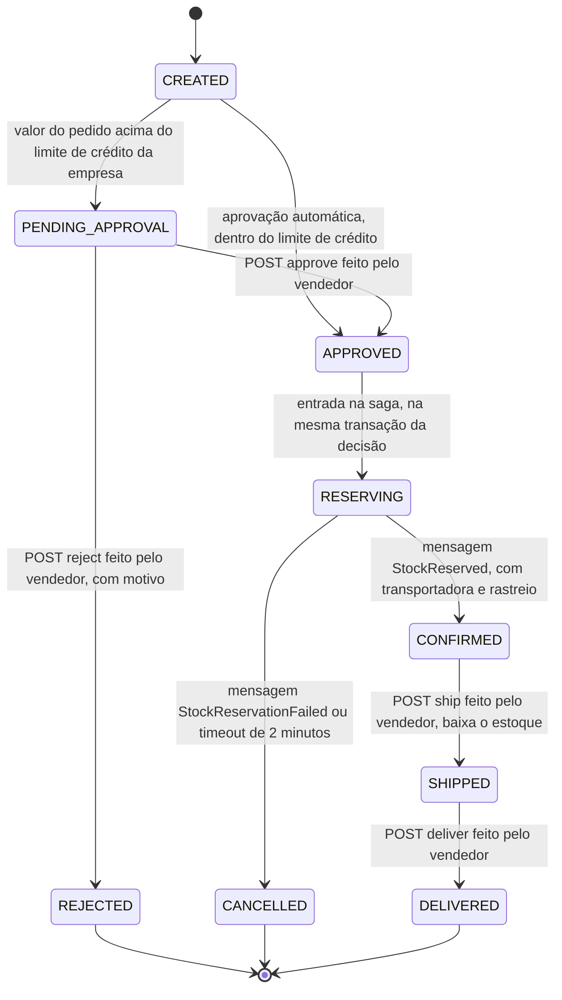

<!-- generated-by: gsd-doc-writer -->
# OrderFlow — Visão Geral

> Documentação voltada a terceiros (integradores, avaliadores técnicos, futuros mantenedores) que
> precisam entender rapidamente o que o OrderFlow faz e como consumir sua API, sem precisar ler o
> histórico de decisões do projeto.

## O que é o OrderFlow

OrderFlow é uma plataforma de gerenciamento de pedidos B2B/atacado: uma empresa vendedora
("seller") disponibiliza um catálogo de produtos para múltiplas empresas compradoras ("buyers"),
que criam pedidos sujeitos a aprovação por limite de crédito, reserva de estoque, atribuição de
transportadora e acompanhamento até a entrega.

É um projeto de portfólio técnico construído para demonstrar, de ponta a ponta, competências de
arquitetura de microsserviços orientada a eventos — não é um produto comercial em operação.

**Valor central do projeto:** o fluxo de pedido (criação → aprovação por limite de crédito →
reserva de estoque → confirmação) funcionando entre microsserviços via orquestração por eventos
(padrão saga). A Fase 5 entrega esse valor central por inteiro: o **order-service** orquestra a
reserva de estoque com o **inventory-service** de forma assíncrona (SQS, Transactional Outbox nos
dois serviços) e todo pedido decidido termina sempre em `CONFIRMED` ou `CANCELLED`, nunca preso num
estado intermediário. A Fase 3 já entregava a primeira integração assíncrona real do projeto — o
**notification-service** consumindo eventos de ajuste de estoque via SQS e mantendo um histórico
consultável em DynamoDB — provando o encanamento de mensageria que a saga da Fase 5 reutiliza e
estende. Ver "Estado atual" abaixo para o que já funciona hoje.

## Estado atual (o que já existe e funciona)

O repositório já expõe, de ponta a ponta e através do Gateway, autenticação, gestão de empresas
compradoras, catálogo de produtos, controle de estoque com reserva protegida contra concorrência,
um histórico de notificações assíncrono — um ajuste de estoque publica um evento `STOCK_ADJUSTED`
numa fila SQS real (LocalStack) que o `notification-service` consome e grava no DynamoDB, sem
nenhuma chamada HTTP entre os dois serviços —, a criação de pedidos com decisão de crédito, e a saga
de reserva de estoque de ponta a ponta: um comprador cria um pedido a partir do catálogo e, dentro
do limite de crédito da empresa, ele é decidido automaticamente; acima do limite, o pedido espera a
decisão manual do vendedor (aprovação ou rejeição, com auditoria de quem/quando/por quê). Um pedido
decidido (automática ou manualmente) entra em `RESERVING` e dispara a reserva assíncrona de estoque
no `inventory-service` — grava o comando `ReserveStock` na mesma transação da decisão (Transactional
Outbox), publica pela fila `inventory-commands-queue`, reserva tudo-ou-nada no
`inventory-service` e devolve o resultado pela fila `order-events-queue` — terminando sempre em
`CONFIRMED` (estoque reservado) ou `CANCELLED` (com código e motivo legível), nunca preso em
`RESERVING`; um job de timeout garante essa propriedade mesmo se o resultado nunca chegar.

A Fase 6 fecha o ciclo do pedido: ao ser confirmado, o pedido recebe uma **transportadora simulada**
(nome fictício) e um **código de rastreio** no padrão dos Correios (S10, ex.: `AB123456789BR`); o
vendedor então o expede (`POST /api/orders/{orderId}/ship`) — o `order-service` grava o comando
`ShipStock` no outbox e o `inventory-service` dá a baixa física do estoque (`quantityOnHand` e
`quantityReserved` caem juntos, uma única vez) — e registra a entrega
(`POST /api/orders/{orderId}/deliver`). Cada transição do pedido vira um evento `ORDER_*` publicado
pelo outbox do `order-service` e gravado pelo `notification-service` no DynamoDB; a jornada inteira é
consultável em `GET /api/notifications/orders/{orderId}`. O diagrama e a tabela de gatilhos estão em
"Ciclo de vida do pedido" abaixo.

| Serviço | Papel | Porta | Exposto externamente |
|---|---|---|---|
| `gateway` | API Gateway — único ponto de entrada para clientes externos | 8080 | Sim |
| `auth-service` | Autenticação (JWT auto-emitido), cadastro de empresas compradoras e limite de crédito | 8081 | Apenas para depuração local; o caminho normal é sempre via `gateway` |
| `catalog-service` | Catálogo de produtos do vendedor (criação, atualização, ativação/descontinuação) | 8082 | Apenas para depuração local; o caminho normal é sempre via `gateway` |
| `inventory-service` | Estoque por produto: quantidade em mãos, reserva e liberação, com proteção contra overselling concorrente; reserva tudo-ou-nada consumida da saga (`inventory-commands-queue`) e devolve o resultado (`order-events-queue`); na expedição (`ShipStock`, Fase 6) dá a baixa física do estoque reservado; publica `STOCK_ADJUSTED` pelo mesmo Transactional Outbox | 8083 | Apenas para depuração local; o caminho normal é sempre via `gateway` |
| `notification-service` | Consome da fila SQS os eventos de ajuste de estoque (`STOCK_ADJUSTED`) e os oito eventos do ciclo de vida do pedido (`ORDER_*`, Fase 6) e mantém o histórico consultável no DynamoDB — por produto e, desde a Fase 6, por pedido (a linha do tempo) | 8084 | Apenas para depuração local; o caminho normal é sempre via `gateway` |
| `order-service` | Criação de pedidos validados contra o catálogo, decisão de aprovação por limite de crédito (automática ou manual) e orquestração da saga de reserva de estoque (Transactional Outbox, consumo do resultado, timeout com compensação); atribui transportadora simulada e rastreio ao confirmar, expede e entrega o pedido (Fase 6) e publica os eventos `ORDER_*` da linha do tempo | 8085 | Apenas para depuração local; o caminho normal é sempre via `gateway` |
| `postgres` | Persistência transacional — um schema por serviço (`auth`, `catalog`, `inventory`, `order`) na mesma instância | 5432 | Não |
| `localstack` | Emulação local de SQS (`notification-events-queue`, `inventory-commands-queue`/DLQ, `order-events-queue`/DLQ) e DynamoDB (`notification-history`), provisionados automaticamente na subida pelo init hook | 4566 | Não |

Através do Gateway, um usuário autenticado já consegue, hoje: fazer login e obter um JWT; cadastrar
e consultar empresas compradoras e limite de crédito; criar, atualizar, listar e
ativar/descontinuar produtos no catálogo (papel `SELLER_ADMIN`); definir, consultar, reservar e
liberar estoque por produto — inclusive sob concorrência, sem reservar mais do que o disponível;
consultar o histórico de notificações de um produto, alimentado de forma assíncrona pelos ajustes
de estoque; e criar pedidos a partir do catálogo, decididos automaticamente pelo limite de crédito
da empresa ou, quando acima do limite, aprovados/rejeitados manualmente pelo vendedor — e acompanhar
o pedido, pelo mesmo Gateway, até a saga de reserva de estoque terminar em `CONFIRMED` ou
`CANCELLED`; expedir e entregar um pedido confirmado (papel `SELLER_ADMIN`) e ler a linha do tempo de
um pedido (o vendedor vê qualquer um, o comprador só os da própria empresa). Ver [API.md](API.md) para a lista completa de endpoints, papéis exigidos e formatos.

## Arquitetura em alto nível

```
Cliente externo
      │
      ▼
  gateway (:8080)  ──── único ponto de entrada; roteia por prefixo de path, não valida token
      │
      ├── /api/auth/**, /api/companies/**  ──▶ auth-service (:8081)  ──▶ PostgreSQL (schema auth)
      │
      ├── /api/products/**                  ──▶ catalog-service (:8082) ──▶ PostgreSQL (schema catalog)
      │
      ├── /api/inventory/**                 ──▶ inventory-service (:8083) ──▶ PostgreSQL (schema inventory)
      │                                            │        ▲
      │                                            │        │ ReserveStock/ReleaseStock (consome)
      │                                            │        │
      │                                            │ outbox_event (inventory) — StockReserved/
      │                                            │ StockReservationFailed/STOCK_ADJUSTED
      │                                            ▼
      │                                      SQS order-events-queue + DLQ ───────────┐
      │                                      SQS notification-events-queue           │ (LocalStack)
      │                                      SQS inventory-commands-queue + DLQ ◀─────┤
      │                                            │                                 │
      │                                            │ consumido de forma assíncrona   │
      │                                            ▼                                 │
      ├── /api/notifications/**             ──▶ notification-service (:8084) ──▶ DynamoDB notification-history (LocalStack)
      │                                                                              │
      └── /api/orders/**                    ──▶ order-service (:8085) ──▶ PostgreSQL (schema order)
                                                   │        │        ▲               │
                                  GET /products/{id} (por item)   GET /companies/{id}/credit-limit
                                                   ▼        ▼        │
                                          catalog-service (:8082)   auth-service (:8081)
                                                   │
                                                   └── outbox_event (order) — ReserveStock/ReleaseStock ──▶ (linha do topo)

Cada serviço acima valida o JWT localmente (JWKS publicado por auth-service em
/.well-known/jwks.json) — nenhuma chamada síncrona de volta ao auth-service a cada requisição. A
ligação entre inventory-service e notification-service é só a fila SQS — nenhum dos dois chama o
outro por HTTP. O order-service faz duas chamadas HTTP síncronas de LEITURA na criação do pedido —
uma por item ao catalog-service, e uma ao auth-service para o limite de crédito — repassando o
próprio JWT do comprador; nenhuma dessas chamadas grava dado nos vizinhos. A partir da Fase 5, a
reserva de estoque entre order-service e inventory-service acontece só por SQS (Transactional
Outbox nos dois lados, D-60): order-service publica ReserveStock/ReleaseStock em
inventory-commands-queue; inventory-service publica o resultado (StockReserved/
StockReservationFailed) e o STOCK_ADJUSTED em order-events-queue/notification-events-queue — nenhum
JWT trafega nessas mensagens, e cada fila da saga tem sua própria DLQ (maxReceiveCount 3, D-61).
```

- O Gateway (Spring Cloud Gateway Server WebMVC) apenas roteia por prefixo de caminho — a validação
  de autenticação e autorização acontece em cada serviço downstream, de forma independente; o
  Gateway em si não tem nenhuma configuração de `spring.security`.
- Todo serviço downstream (`auth-service`, `catalog-service`, `inventory-service`) valida o mesmo
  JWT localmente como OAuth2 Resource Server, buscando as chaves públicas via JWKS
  (`SPRING_SECURITY_OAUTH2_RESOURCESERVER_JWT_JWK_SET_URI`, apontando para
  `http://auth-service:8081/.well-known/jwks.json`), sem depender de uma chamada síncrona ao
  `auth-service` a cada requisição.
- Isolamento entre empresas compradoras é reforçado no nível de aplicação (um "guard" avaliado
  antes de qualquer acesso a dados), não por um filtro implícito de banco de dados.
- Cada serviço com persistência transacional é dono de seu próprio schema PostgreSQL (`auth`,
  `catalog`, `inventory`, `order`) dentro da mesma instância de banco — isolamento lógico de dados
  por serviço sem o custo de operar um container Postgres por serviço.
- A partir da Fase 5, `order-service` e `inventory-service` implementam o padrão Transactional
  Outbox de forma independente e duplicada (D-62, sem módulo compartilhado): cada um grava
  eventos/comandos na própria tabela `outbox_event`, na mesma transação de negócio, e um relay
  `@Scheduled` publica depois no SQS real — nunca uma escrita no banco e uma publicação separadas
  (dual-write).

## Ciclo de vida do pedido (Fase 6)

Um pedido passa por nove estados. O diagrama abaixo tem exatamente as nove transições permitidas
pelo código — a tabela única `OrderStatus.transitions()` do `order-service`, que todo método de
transição consulta — e cada rótulo diz o que a dispara:



| Transição | Gatilho | Endpoint ou mensagem | Evento da linha do tempo |
|---|---|---|---|
| (criação) | Comprador cria o pedido | `POST /api/orders` | `ORDER_CREATED` (`createdBy`, `total`) |
| `CREATED` → `PENDING_APPROVAL` | Valor acima do limite de crédito na criação | `POST /api/orders` | `ORDER_PENDING_APPROVAL` |
| `CREATED` → `APPROVED` | Aprovação automática dentro do limite de crédito (`decidedBy` = `SYSTEM`) | `POST /api/orders` | `ORDER_APPROVED` |
| `PENDING_APPROVAL` → `APPROVED` | Decisão manual do vendedor | `POST /api/orders/{orderId}/approve` | `ORDER_APPROVED` (`decidedBy` = vendedor, motivo opcional) |
| `PENDING_APPROVAL` → `REJECTED` | Decisão manual do vendedor | `POST /api/orders/{orderId}/reject` | `ORDER_REJECTED` (`decidedBy`, `reason`) |
| `APPROVED` → `RESERVING` | Entrada na saga, na mesma transação da decisão; o comando `ReserveStock` vai para o outbox | comando `ReserveStock` em `inventory-commands-queue` | sem evento próprio |
| `RESERVING` → `CONFIRMED` | O `inventory-service` reservou todos os itens | mensagem `StockReserved` em `order-events-queue` | `ORDER_CONFIRMED` (`carrier`, `trackingCode`) |
| `RESERVING` → `CANCELLED` | Reserva recusada, ou nenhum resultado em 2 minutos | mensagem `StockReservationFailed` em `order-events-queue`, ou o job de timeout | `ORDER_CANCELLED` (`cancellationCode`, `cancellationReason`) |
| `CONFIRMED` → `SHIPPED` | Vendedor expede; o comando `ShipStock` vai para o outbox | `POST /api/orders/{orderId}/ship`; comando `ShipStock` em `inventory-commands-queue` | `ORDER_SHIPPED` (`shippedBy`) |
| `SHIPPED` → `DELIVERED` | Vendedor registra a entrega; nenhuma mensagem de estoque | `POST /api/orders/{orderId}/deliver` | `ORDER_DELIVERED` (`deliveredBy`) |

`CREATED` e `APPROVED` são passos lógicos da mesma transação e nunca são observados em repouso pela
API. `CANCELLED` só é alcançado pela saga (não há endpoint de cancelamento). Tentar qualquer outra
aresta — por exemplo expedir um pedido `CANCELLED` — devolve `409 invalid_order_transition` sem
alterar o pedido. O diagrama acima e o do README são conferidos por teste contra a tabela do código
(`OrderStatusDiagramConsistencyTest`), e a API é conferida contra a mesma tabela pelo
`OrderLifecycleTransitionsIT`.

**Transportadora e rastreio são simulados.** Ao confirmar o pedido, o `order-service` chama a costura
`CarrierGateway`; a única implementação, `SimulatedCarrierGateway`, escolhe de forma determinística,
a partir do `orderId`, uma de cinco transportadoras com nomes fictícios e gera um código no padrão
S10 dos Correios (duas letras, nove dígitos e `BR`) — sem rede e sem integração real. É nessa costura
que uma API de transportadora de verdade entraria.

**Como a linha do tempo é construída.** Cada transição grava, na mesma transação, um evento `ORDER_*`
no outbox do `order-service`; o relay publica na `notification-events-queue`, o `notification-service`
consome e grava um item por evento no DynamoDB, e `GET /api/notifications/orders/{orderId}` devolve o
histórico em ordem de ciclo de vida. A expedição segue o mesmo caminho do outbox para o estoque: o
`ShipStock` publicado pelo relay faz o `inventory-service` baixar `quantityOnHand` e
`quantityReserved` do pedido, uma única vez, mesmo que a mensagem seja reentregue.

## Stack técnica

Java 21, Spring Boot 3.5.16, Spring Cloud 2025.0.3 ("Northfields") com Spring Cloud Gateway Server
WebMVC, Spring Security (OAuth2 Resource Server, JWT auto-emitido via Nimbus), PostgreSQL 16.15 com
Flyway, springdoc-openapi 2.9.1 (Swagger UI por serviço), Docker Compose V2 para orquestração
local. SQS (via Spring Cloud AWS) e DynamoDB (via AWS SDK v2 Enhanced Client) rodam contra
LocalStack (imagem `localstack/localstack:2026.08.3`) — as filas `notification-events-queue`,
`inventory-commands-queue`/DLQ e `order-events-queue`/DLQ (Fase 5, D-61), além da tabela
`notification-history`, são provisionadas automaticamente por init hooks na subida da stack. O
`inventory-service` e o `order-service` produzem e consomem eventos reais entre si pela saga de
reserva de estoque (Fase 5), e o `inventory-service` publica `STOCK_ADJUSTED` para o
`notification-service` pelo mesmo Transactional Outbox. Um módulo Maven adicional, `e2e-tests` (sem
`src/main`), sobe `order-service` e `inventory-service` como dois contextos Spring Boot reais no
mesmo JVM para provar a saga inteira com Postgres/LocalStack via Testcontainers
(`./mvnw -B -pl e2e-tests -am verify`).

## Documentação interativa (Swagger UI)

Além da referência estática em [API.md](API.md), `auth-service`, `catalog-service`,
`inventory-service`, `notification-service` e `order-service` servem Swagger UI na própria porta
direta de cada um — **não** pelo Gateway:

| Serviço | Swagger UI |
|---|---|
| `auth-service` | http://localhost:8081/swagger-ui.html |
| `catalog-service` | http://localhost:8082/swagger-ui.html |
| `inventory-service` | http://localhost:8083/swagger-ui.html |
| `notification-service` | http://localhost:8084/swagger-ui.html |
| `order-service` | http://localhost:8085/swagger-ui.html |

A página carrega sem token (é uma ferramenta local de desenvolvimento, deliberadamente aceita —
ver `SecurityConfig.java` de cada serviço). O botão **Authorize** aceita um JWT colado (obtido em
`POST /api/auth/login`) e permite exercitar qualquer endpoint protegido via **Try it out**
diretamente no navegador, sem montar `curl` à mão. Como a UI roda na porta do serviço, não do
Gateway, os caminhos exibidos não têm o prefixo `/api` (`StripPrefix=1` do Gateway não se aplica
aqui).

## Para onde ir a partir daqui

- **Consumir a API hoje:** [API.md](API.md) — todos os endpoints disponíveis, com autenticação,
  formatos de requisição/resposta e códigos de erro.
- **Testar no navegador:** as cinco Swagger UIs acima — visualização e teste rápido sem cliente HTTP.
- **Subir o projeto localmente:** [README.md](../README.md) na raiz do repositório — pré-requisitos,
  variáveis de ambiente e o passo a passo de `docker compose up`.

## Como esta documentação é mantida atualizada

Os arquivos desta pasta (`docs/`) são gerados e revisados automaticamente a partir do código-fonte
real do projeto (controllers, DTOs, configuração de segurança e rotas), não escritos à mão a partir
de memória. Sempre que o projeto ganhar novos serviços ou endpoints, regenere esta pasta descrevendo
a mudança para o Claude Code (por exemplo: "atualize a documentação de terceiros com os novos
endpoints do inventory-service").
