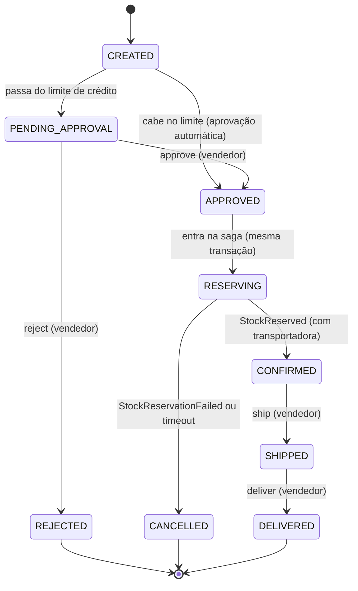

# O ciclo de vida do pedido — expedição e entrega (Fase 6)

Arquivos:
- `order-service/src/main/java/com/orderflow/order/order/OrderStatus.java` (a tabela de transições)
- `order-service/src/main/java/com/orderflow/order/order/Order.java` (`moveTo`, `confirm`, `ship`, `deliver`)
- `order-service/src/main/java/com/orderflow/order/order/OrderShipmentController.java` e `OrderShipmentService.java`
- `order-service/src/main/java/com/orderflow/order/order/exception/InvalidOrderTransitionException.java`
- `order-service/src/main/java/com/orderflow/order/shipping/` (`CarrierGateway`, `SimulatedCarrierGateway`, `CarrierAssignment`, `TrackingCodes`)
- `order-service/src/main/java/com/orderflow/order/saga/messaging/dto/ShipStockCommand.java`
- `order-service/src/main/resources/db/migration/V3__order_fulfillment.sql`
- `inventory-service/src/main/java/com/orderflow/inventory/stock/InventoryService.java` (`shipAll`)
- `inventory-service/src/main/resources/db/migration/V4__stock_reservation_shipped.sql`
- Testes: `OrderStatusTransitionsTest`, `OrderLifecycleTransitionsIT`, `OrderStatusDiagramConsistencyTest`

Continuação de [26-saga-de-reserva-de-estoque.md](26-saga-de-reserva-de-estoque.md), onde o
pedido termina `CONFIRMED` ou `CANCELLED`. Aqui o pedido confirmado ganha uma transportadora, é
**expedido** e depois **entregue**. O estoque, que até agora estava só reservado, finalmente sai
da prateleira.

## O que muda, em uma frase

Até a Fase 5, `SHIPPED` e `DELIVERED` existiam no enum mas nenhum código chegava neles. Na Fase
6 eles viraram estados **reais**: o vendedor chama `POST /orders/{id}/ship` e
`POST /orders/{id}/deliver`, e cada mudança de status passa por **uma tabela única** que diz o
que é permitido.

## 1. O mapa dos estados



Versão em texto, para quem lê fora de um visualizador de Mermaid:

```
CREATED ─┬─ cabe no crédito ─► APPROVED ─► RESERVING ─┬─ StockReserved ─► CONFIRMED ─ ship ─► SHIPPED ─ deliver ─► DELIVERED
         │                        ▲                    └─ falha/timeout ─► CANCELLED
         └─ passa do limite ─► PENDING_APPROVAL
                                  ├─ approve ─┘
                                  └─ reject ─► REJECTED
```

São **9 setas**. Três estados não têm saída (são *terminais*): `REJECTED`, `CANCELLED` e
`DELIVERED`. E dois estados nunca são vistos "parados" pela API: `CREATED` e `APPROVED` só
existem dentro da transação da criação ou da decisão (ver
[26-saga-de-reserva-de-estoque.md](26-saga-de-reserva-de-estoque.md), seção 2).

Repara que **não existe seta para `CANCELLED` a partir de `CONFIRMED`**. Não há endpoint de
cancelamento manual: um pedido só é cancelado pela saga (falha de estoque ou tempo limite).

## 2. A tabela única — `OrderStatus.transitions()`

Antes da Fase 6, cada método do `Order` tinha seu próprio `if` ("só posso aprovar se estiver
pendente"…). Com 9 estados, essas regras espalhadas viram um risco: alguém muda uma e esquece a
outra. A solução foi guardar **todas as setas num lugar só**, dentro do próprio enum:

```java
private static Map<OrderStatus, Set<OrderStatus>> buildTransitions() {
    Map<OrderStatus, Set<OrderStatus>> table = new EnumMap<>(OrderStatus.class);
    table.put(CREATED, EnumSet.of(PENDING_APPROVAL, APPROVED));
    table.put(PENDING_APPROVAL, EnumSet.of(APPROVED, REJECTED));
    // APPROVED -> RESERVING é o APPROVED lógico da D-50: mesma transação, nunca observado em repouso.
    table.put(APPROVED, EnumSet.of(RESERVING));
    table.put(REJECTED, EnumSet.noneOf(OrderStatus.class));
    table.put(RESERVING, EnumSet.of(CONFIRMED, CANCELLED));
    table.put(CONFIRMED, EnumSet.of(SHIPPED));
    table.put(CANCELLED, EnumSet.noneOf(OrderStatus.class));
    table.put(SHIPPED, EnumSet.of(DELIVERED));
    table.put(DELIVERED, EnumSet.noneOf(OrderStatus.class));
    table.replaceAll((status, targets) -> Collections.unmodifiableSet(targets));
    return Collections.unmodifiableMap(table);
}

public boolean canTransitionTo(OrderStatus target) {
    return TRANSITIONS.get(this).contains(target);
}
```

- **`EnumMap` e `EnumSet`** são um `Map` e um `Set` especializados para enums: mais rápidos e
  sempre na ordem em que os valores foram declarados.
- **`EnumSet.noneOf(...)`** é um conjunto vazio: "daqui não se sai".
- **`unmodifiableMap`/`unmodifiableSet`**: quem chama `transitions()` recebe a tabela, mas não
  consegue alterá-la. Ela é a "fonte única de verdade" (D-83).
- **`canTransitionTo`** responde à pergunta "posso ir de `this` para `target`?" olhando a
  tabela.

É como o mapa do metrô colado na parede: em vez de cada maquinista decorar por onde pode
passar, todos consultam o mesmo mapa.

### O teste dos 81 pares — `OrderStatusTransitionsTest`

São 9 estados, então existem 9 × 9 = **81 pares** possíveis (de → para). O teste escreve a lista
das 9 setas **de novo, à mão** (`DOCUMENTED`), gera os 81 pares e confere cada um:

```java
@ParameterizedTest(name = "{0} -> {1} allowed={2}")
@MethodSource("allPairs")
void canTransitionToMatchesTheDocumentedEdgeForEveryOneOfThe81Pairs(
        OrderStatus from, OrderStatus to, boolean expected) {
    assertThat(from.canTransitionTo(to)).isEqualTo(expected);
}
```

`@ParameterizedTest` com `@MethodSource` roda o mesmo teste uma vez para cada linha que o
método `allPairs()` devolve. Se alguém acrescentar uma seta na tabela sem querer (por exemplo
`CANCELLED → SHIPPED`), um desses 81 casos falha. Outros três testes conferem que são
exatamente 81 pares e 9 setas, que a tabela é imutável e que os terminais são só os três
esperados.

## 3. `Order.moveTo` — o único lugar que muda o status

Toda transição do `Order` termina chamando o mesmo método privado:

```java
private void moveTo(OrderStatus target, java.util.function.Supplier<? extends RuntimeException> rejection) {
    if (!this.status.canTransitionTo(target)) {
        throw rejection.get();
    }
    this.status = target;
}
```

- `this.status = target` aparece **uma única vez** na classe (só a fábrica `create` define o
  status inicial). Nenhum método consegue "pular" a tabela.
- O segundo parâmetro é um **`Supplier`**: "algo que, quando chamado, fabrica a exceção". Cada
  método escolhe qual erro faz sentido para ele, mas a decisão de recusar é sempre da tabela.
- A checagem vem **antes** de qualquer campo ser tocado. Uma transição recusada nunca deixa o
  pedido pela metade.

Por que cada método passa uma exceção diferente? Porque cada uma vira uma resposta diferente:

| Método | Exceção se a tabela recusar | Resposta HTTP |
|---|---|---|
| `approveManually`, `reject` | `OrderNotPendingException` | 409 `order_not_pending` (contrato da Fase 4, mantido) |
| `ship`, `deliver` | `InvalidOrderTransitionException` | 409 `invalid_order_transition` |
| `startReservation`, `confirm`, `cancel` | `IllegalStateException` | nenhuma: só a saga chama, então é erro de programação |

### `InvalidOrderTransitionException` → 409

```java
public InvalidOrderTransitionException(OrderStatus from, OrderStatus to) {
    super("Order cannot transition from " + from + " to " + to);
    ...
}
```

O `GlobalExceptionHandler` do `order-service` transforma isso em:

```json
{ "error": "invalid_order_transition",
  "message": "Order cannot transition from CONFIRMED to DELIVERED" }
```

A mensagem só carrega **nomes do enum**, nunca texto que o usuário mandou. Por que 409
(*Conflict*)? A requisição está bem escrita; o problema é o **estado atual** do pedido, que não
combina com a ação (ver [09-global-exception-handler.md](09-global-exception-handler.md)).

## 4. A transportadora — `Order.confirm` e `CarrierGateway`

Quando o `StockReserved` chega e o pedido vai para `CONFIRMED`, ele ganha na **mesma transação**
uma transportadora e um código de rastreio. Nunca existe pedido confirmado sem transportadora
(D-70):

```java
public void confirm(OffsetDateTime now, CarrierAssignment assignment) {
    if (assignment == null) {
        throw new IllegalArgumentException("a confirmed order requires a carrier assignment");
    }
    moveTo(OrderStatus.CONFIRMED, () -> notIn(OrderStatus.RESERVING));
    this.confirmedAt = now;
    this.carrier = assignment.carrier();
    this.trackingCode = assignment.trackingCode();
}
```

Quem chama é o `OrderSagaService.applyStockReserved`, no único ramo que confirma:

```java
order.confirm(now, carrierGateway.assign(order.getId()));
```

### A "costura" — `CarrierGateway`

```java
public interface CarrierGateway {
    CarrierAssignment assign(UUID orderId);
}
```

Uma **costura** (*seam*) é um ponto do código preparado para trocar uma peça sem mexer no resto.
Hoje a única implementação é a `SimulatedCarrierGateway`. Se um dia houver uma transportadora de
verdade, basta escrever outra classe que implemente a interface. O `OrderSagaService` não muda,
porque recebe o `CarrierGateway` pelo construtor (D-71).

É **simulação** de propósito: o projeto não fala com nenhuma transportadora real, e o código de
rastreio não é consultável em lugar nenhum. Os cinco nomes são fictícios:

```java
public static final List<String> CARRIERS = List.of(
        "Expresso Cerrado", "TransSul Cargas", "Rapido Paulista", "Norte Entregas", "Litoral Log");
```

### Determinística: o mesmo pedido, sempre a mesma resposta

```java
@Override
public CarrierAssignment assign(UUID orderId) {
    byte[] digest = sha256(orderId.toString());
    int index = Math.floorMod(((digest[0] & 0xFF) << 8) | (digest[1] & 0xFF), CARRIERS.size());
    return new CarrierAssignment(CARRIERS.get(index), TrackingCodes.fromDigest(digest));
}
```

- **SHA-256** é uma função de *hash*: transforma qualquer texto em 32 bytes que parecem
  aleatórios, mas são **sempre os mesmos** para o mesmo texto. É como uma impressão digital do
  `orderId`.
- Os bytes 0 e 1 escolhem a transportadora (o resto da divisão por 5). Os bytes seguintes
  montam o código de rastreio.

Por que não usar `Random`? Porque o `StockReserved` pode chegar **duas vezes** (o outbox é "pelo
menos uma vez", ver nota 26). Com sorteio, a segunda entrega poderia trocar a transportadora.
Com a impressão digital, a resposta é idêntica, e a duplicata não muda nada. Além disso o método
não faz rede e nunca lança exceção, o que importa porque ele roda **dentro** da transação, com a
linha do pedido trancada (D-72).

### O código S10 — `TrackingCodes`

**S10** é um padrão da **UPU** (União Postal Universal, a organização que coordena os correios
do mundo) para códigos de rastreio internacionais. É o formato que você já viu num pacote dos
Correios: `AB123456789BR`.

| Parte | Exemplo | Significado |
|---|---|---|
| 2 letras | `AB` | Tipo de serviço |
| 8 dígitos | `12345678` | Número de série |
| 1 dígito | `9` | **Dígito verificador** |
| `BR` | `BR` | País de origem |

O dígito verificador é uma conta feita sobre os 8 dígitos, para pegar erros de digitação (como
o último dígito do CPF):

```java
private static final int[] WEIGHTS = {8, 6, 4, 2, 3, 5, 9, 7};
...
int check = 11 - (sum % 11);
if (check == 10) {
    return 0;
}
if (check == 11) {
    return 5;
}
return check;
```

Cada dígito é multiplicado pelo seu peso, soma-se tudo, e o resultado sai de `11 - (soma mod 11)`.
Exemplo usado no teste: `47312482` → 4×8 + 7×6 + 3×4 + 1×2 + 2×3 + 4×5 + 8×9 + 2×7 = 200;
200 mod 11 = 2; 11 − 2 = **9**.

`TrackingCodes.fromDigest` usa os bytes 2 e 3 do hash para as letras e os bytes 4 a 11 para o
número de série. O record `CarrierAssignment` confere o formato no construtor
(`TrackingCodes.isValid`), então um código inválido nunca chega ao banco.

**Unicidade probabilística:** não há `UNIQUE` no banco para o rastreio. São 26² × 10⁸
combinações, então uma colisão é muito improvável. E um `UNIQUE` seria perigoso aqui: como o
código é determinístico, uma colisão derrubaria a transação do `CONFIRMED` **toda vez** que o
mesmo `StockReserved` fosse reentregue, num laço até a DLQ.

## 5. As colunas novas — `V3__order_fulfillment.sql`

```sql
ALTER TABLE orders ADD COLUMN carrier VARCHAR(64);
ALTER TABLE orders ADD COLUMN tracking_code VARCHAR(13);
ALTER TABLE orders ADD COLUMN shipped_at TIMESTAMPTZ;
ALTER TABLE orders ADD COLUMN shipped_by VARCHAR(64);
ALTER TABLE orders ADD COLUMN delivered_at TIMESTAMPTZ;
ALTER TABLE orders ADD COLUMN delivered_by VARCHAR(64);
```

Todas nasceram juntas, para o contrato do `OrderResponse` mudar uma vez só: o JSON do pedido
ganhou `carrier`, `trackingCode`, `shippedAt`, `shippedBy`, `deliveredAt` e `deliveredBy`
(nulos enquanto não se aplicam).

A migration também repete as regras do Java **no banco**, como rede de segurança:

```sql
ALTER TABLE orders ADD CONSTRAINT chk_orders_tracking_code_format
    CHECK (tracking_code IS NULL OR tracking_code ~ '^[A-Z]{2}[0-9]{9}BR$');
ALTER TABLE orders ADD CONSTRAINT chk_orders_shipping_assigned
    CHECK (status NOT IN ('CONFIRMED', 'SHIPPED', 'DELIVERED')
           OR (carrier IS NOT NULL AND tracking_code IS NOT NULL));
```

`~` é o operador de expressão regular do Postgres. Antes das `CHECK`s, um `UPDATE` preenche os
pedidos **antigos** já confirmados (de bancos de desenvolvimento anteriores à Fase 6) com
`'Transportadora Legada'` e um código `LG...BR`. Sem esse *backfill*, a `CHECK` falharia na
subida (ver [08-flyway-migrations.md](08-flyway-migrations.md)). Esses códigos legados casam o
formato, mas não têm o dígito S10 correto.

## 6. Expedir e entregar — `OrderShipmentController` e `OrderShipmentService`

| Endpoint | Papel | Só funciona a partir de | Vai para |
|---|---|---|---|
| `POST /orders/{orderId}/ship` | `SELLER_ADMIN` | `CONFIRMED` | `SHIPPED` |
| `POST /orders/{orderId}/deliver` | `SELLER_ADMIN` | `SHIPPED` | `DELIVERED` |

- **Sem corpo.** A transportadora e o rastreio já foram definidos ao confirmar.
- **Quem agiu vem do JWT** (a claim `sub`, por `requireSellerId`), nunca do JSON. Vai para
  `shippedBy` / `deliveredBy`.
- É um controller **irmão** do `OrderDecisionController`: cada grupo de ações do ciclo de vida
  numa classe pequena.

O service:

```java
@Transactional
public OrderResponse ship(UUID orderId, String sellerId) {
    Order order = lockOrder(orderId);
    OffsetDateTime now = currentInstant();

    order.ship(sellerId, now);

    ShipStockCommand command = ShipStockCommand.from(order, UUID.randomUUID(), now.toInstant());
    outboxWriter.enqueue(command.eventId(), ShipStockCommand.EVENT_TYPE, order.getId().toString(), command);
    orderTimelineEvents.shipped(order);
    return OrderResponse.from(order);
}

@Transactional
public OrderResponse deliver(UUID orderId, String sellerId) {
    Order order = lockOrder(orderId);

    order.deliver(sellerId, currentInstant());
    orderTimelineEvents.delivered(order);

    return OrderResponse.from(order);
}
```

- **`lockOrder`** usa `findByIdForUpdate`, a mesma trava de linha da saga. Se dois vendedores
  clicarem "expedir" ao mesmo tempo, o segundo espera, relê o pedido já `SHIPPED` e recebe 409.
  Só um `ShipStock` é gravado.
- **Não usa a trava de crédito da empresa** (nota 21). `CONFIRMED`, `SHIPPED` e `DELIVERED`
  já consomem crédito, então a exposição não muda.
- **`ship` grava duas coisas no outbox**, na mesma transação do `SHIPPED`: o comando `ShipStock`
  para o estoque e o evento `ORDER_SHIPPED` para a linha do tempo.
- **`deliver` não manda nada ao estoque.** A mercadoria já saiu na expedição. Só grava
  `ORDER_DELIVERED` para a linha do tempo.
- **Não existe estado `SHIPPING`.** O pedido vai direto para `SHIPPED` e não espera resposta do
  estoque. Por alguns segundos, o pedido já está expedido e o estoque ainda mostra a reserva.
  É a consistência eventual de sempre.

## 7. A baixa física — `ShipStock` no `inventory-service`

### O comando

Mesmo envelope dos outros comandos da saga, sem `reason`, na `inventory-commands-queue`:

```json
{ "eventId": "…", "eventType": "ShipStock", "occurredAt": "…",
  "orderId": "…", "reservationId": "<orderId em texto>",
  "items": [ { "productId": "…", "quantity": 3 } ] }
```

O `OutboxRelay.resolveQueue` do `order-service` manda `ReserveStock`, `ReleaseStock` e
`ShipStock` para a mesma fila. No `inventory-service`, o `ReservationCommandListener` decide pelo
tipo (`instanceof ShipStockCommand`) e chama `InventoryService.shipAll`.

### A migration `V4__stock_reservation_shipped.sql`

```sql
ALTER TABLE stock_reservations ADD COLUMN shipped BOOLEAN NOT NULL DEFAULT FALSE;
ALTER TABLE stock_reservations ADD COLUMN shipped_at TIMESTAMPTZ;

ALTER TABLE stock_reservations
    ADD CONSTRAINT chk_stock_reservations_not_released_and_shipped CHECK (NOT (released AND shipped));
```

Cada linha do "livro" de reservas agora sabe se já foi **expedida**. E o banco proíbe uma
reserva ser liberada **e** expedida ao mesmo tempo.

### `shipAll`, uma linha por vez

Para cada produto, em ordem de `productId` (a mesma ordem que evita *deadlock* na nota 26):

| Situação da linha no livro | O que acontece |
|---|---|
| **Não existe** | `IllegalStateException`: anomalia técnica, vai para reentrega e depois DLQ |
| **Já expedida** (`shipped`) | Nada; log `INFO`. É uma reentrega do mesmo comando |
| **Liberada** (pedido cancelado) | `IllegalStateException` |
| **Viva** | `inventory.ship(quantidade)` + `reservation.markShipped(agora)` |

```java
// Sempre a quantidade do LIVRO, nunca a do comando.
inventory.ship(reservation.getQuantity());
reservation.markShipped(OffsetDateTime.now());
```

E o `Inventory.ship` baixa **as duas colunas** pelo mesmo valor:

```java
this.quantityOnHand -= quantidade;
this.quantityReserved -= quantidade;
```

Exemplo do smoke: 10 em estoque, 3 reservados → depois da expedição, 7 em estoque, 0
reservados. O **disponível** (`onHand − reserved`) continua 7 antes e depois, porque aqueles 3
já estavam separados.

Três detalhes de segurança:

- **A quantidade vem do livro**, não do comando. Um `ShipStock` forjado com `quantity: 1000`
  não consegue baixar mais do que foi reservado.
- **Idempotente, uma vez por reserva.** A marca `shipped` é a memória: reentregar o `ShipStock`
  (com o mesmo `eventId` ou outro) não baixa de novo.
- **A expedição não publica `STOCK_ADJUSTED`.** Esse evento quer dizer "o vendedor ajustou o
  estoque", e a expedição não é isso. A prova da baixa é `GET /inventory/{productId}`.

### Liberar depois de expedir: ignorado

E se um `ReleaseStock` atrasado chegar depois da expedição? Liberar devolveria a quantidade a
`quantity_reserved`, que já foi baixada. O número ficaria errado e poderia "roubar" a reserva de
outro pedido do mesmo produto. Por isso `releaseAll` (saga) e `release` (REST) pulam reservas
expedidas:

```java
if (reservation.isShipped()) {
    log.warn("ReleaseStock ignorado: reserva ja expedida orderId={} productId={} reservationId={}",
            orderId, line.productId(), reservationId);
    continue;
}
```

A `CHECK` da V4 é a última barreira, caso essa guarda um dia falhe.

## 8. Os três testes que travam o ciclo de vida

| Teste | Prova que… |
|---|---|
| `OrderStatusTransitionsTest` (unitário) | a **tabela** tem exatamente as 9 setas (81 pares conferidos) |
| `OrderLifecycleTransitionsIT` (integração) | a **API** obedece à tabela |
| `OrderStatusDiagramConsistencyTest` (unitário) | os **diagramas da documentação** batem com a tabela |

### `OrderLifecycleTransitionsIT`: 36 pares

Grava por JDBC um pedido em cada um dos 9 status e chama cada uma das 4 ações do vendedor
(`approve`, `reject`, `ship`, `deliver`): 9 × 4 = **36 execuções**.

```java
enum SellerAction {
    APPROVE(OrderStatus.PENDING_APPROVAL, OrderStatus.APPROVED, OrderStatus.RESERVING),
    REJECT(OrderStatus.PENDING_APPROVAL, OrderStatus.REJECTED, OrderStatus.REJECTED),
    SHIP(OrderStatus.CONFIRMED, OrderStatus.SHIPPED, OrderStatus.SHIPPED),
    DELIVER(OrderStatus.SHIPPED, OrderStatus.DELIVERED, OrderStatus.DELIVERED);
```

Para cada par: se o pedido está na origem da seta da ação, espera **200** e o novo status. Senão,
espera **409** (`order_not_pending` para approve/reject, `invalid_order_transition` para
ship/deliver) e confere no banco que **nada mudou**. Outros testes da mesma classe cobrem 404
(pedido inexistente), 403 (`BUYER` tentando expedir), 401 (sem token) e 400 (id que não é UUID).

### `OrderStatusDiagramConsistencyTest`: o diagrama não pode mentir

Documentação desatualizada é um problema clássico. Este teste lê o `README.md` e o
`docs/VISAO-GERAL.md`, procura cada bloco ` ```mermaid ` com `stateDiagram-v2`, extrai as setas
`A --> B` (ignorando as de `[*]`) e compara com `OrderStatus.transitions()`:

```java
@ParameterizedTest(name = "{0}")
@ValueSource(strings = {"../README.md", "../docs/VISAO-GERAL.md"})
void everyStateDiagramInTheDocumentMatchesTheTransitionTableExactly(String document) throws IOException {
```

Uma seta a mais, a menos, ou com um estado que não existe **quebra o build**. Outros testes da
classe provam que o comparador "tem dentes": acusa aresta sobrando, aresta faltando, estado
inexistente e linha malformada.

O diagrama da seção 1 desta nota **não** é conferido pelo teste, porque só aqueles dois arquivos
são lidos. Ele foi copiado das mesmas 9 setas.

## 9. O ciclo completo, de ponta a ponta

```
SELLER_ADMIN → POST /api/orders/{id}/ship
   order-service (uma transação, pedido trancado)
   ├─ CONFIRMED → SHIPPED  (shippedBy = sub, shippedAt)
   ├─ outbox: ShipStock      → inventory-commands-queue → shipAll → onHand e reserved caem
   └─ outbox: ORDER_SHIPPED  → notification-events-queue → linha do tempo no DynamoDB
   ← 200 com o pedido SHIPPED

SELLER_ADMIN → POST /api/orders/{id}/deliver
   ├─ SHIPPED → DELIVERED  (deliveredBy, deliveredAt)
   └─ outbox: ORDER_DELIVERED → notification-events-queue
   ← 200 com o pedido DELIVERED (fim)

Comprador ou vendedor → GET /api/notifications/orders/{id}
   ← ORDER_CREATED, ORDER_APPROVED, ORDER_CONFIRMED, ORDER_SHIPPED, ORDER_DELIVERED
```

Esse caminho inteiro roda na stack real com `bash scripts/smoke-order-lifecycle.sh` (ver
[24-scripts-smoke.md](24-scripts-smoke.md)).

## Resumindo com uma analogia

Pensa na **ficha de um pedido** pendurada num quadro de avisos:

- Na parede há um **mapa de setas** (a tabela de transições). Ninguém risca o status da ficha à
  mão: o único carimbo (`moveTo`) confere o mapa antes de carimbar. Se a seta não existe, o
  carimbo recusa e a ficha fica como estava.
- Quando a ficha vira "confirmado", o atendente consulta uma **tabela fixa** que, pelo número do
  pedido, sempre aponta a mesma transportadora e o mesmo código de rastreio. Se perguntar duas
  vezes, ouve a mesma resposta.
- Na expedição, o vendedor carimba "expedido" e, no mesmo caderno, deixa um bilhete para o
  almoxarifado: "pode tirar da prateleira o que estava separado para este pedido". O almoxarife
  usa a quantidade que **ele mesmo** anotou na separação, não a do bilhete, e marca a linha como
  "saiu". Bilhete repetido? A linha já está marcada, então ele não tira de novo.
- Na entrega, o vendedor só carimba "entregue". Não há mais nada a tirar da prateleira.
- E alguém confere, a cada build, se o **desenho do mapa** pendurado na recepção (o README) é
  igual ao mapa de verdade.
